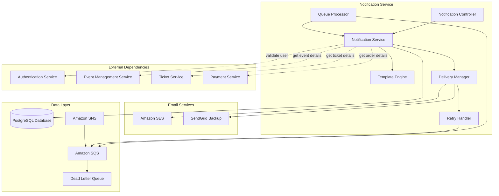
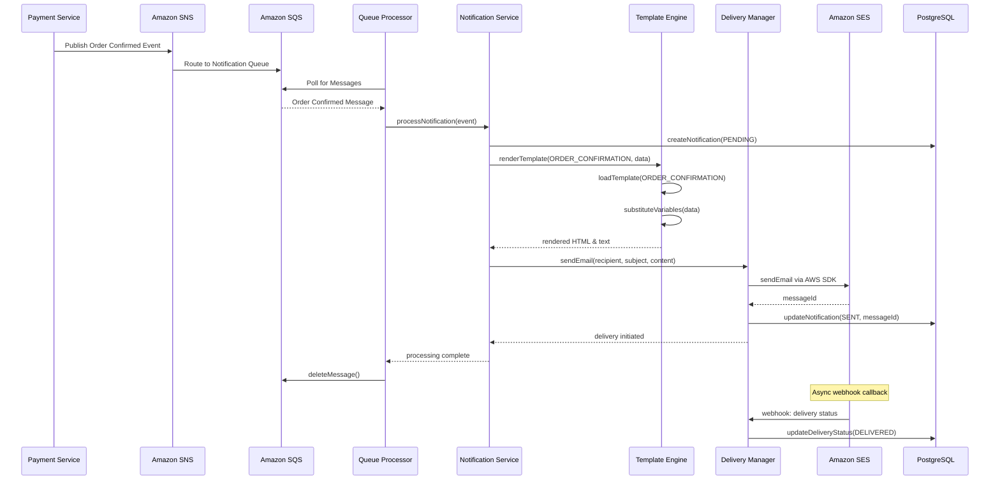
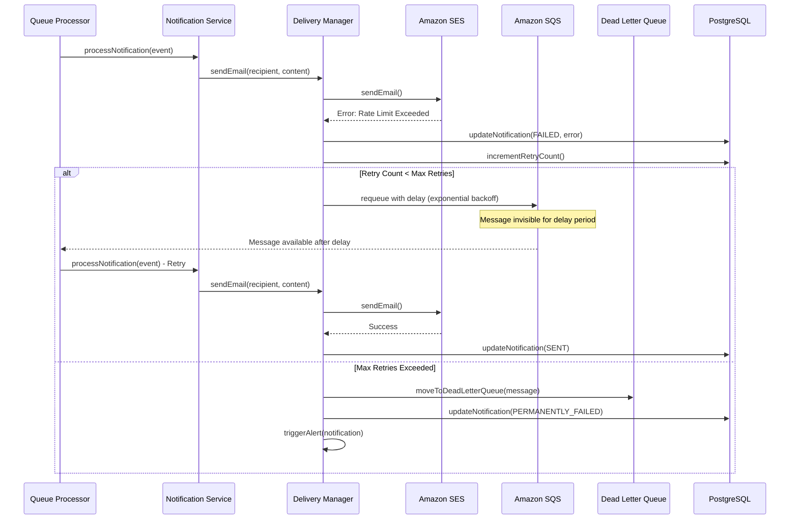
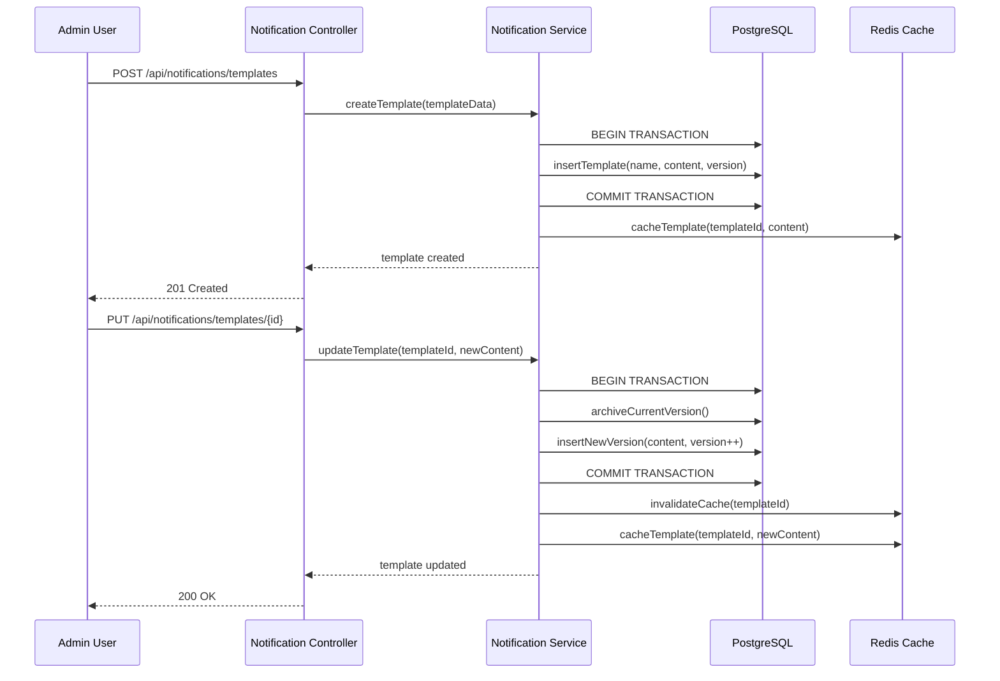
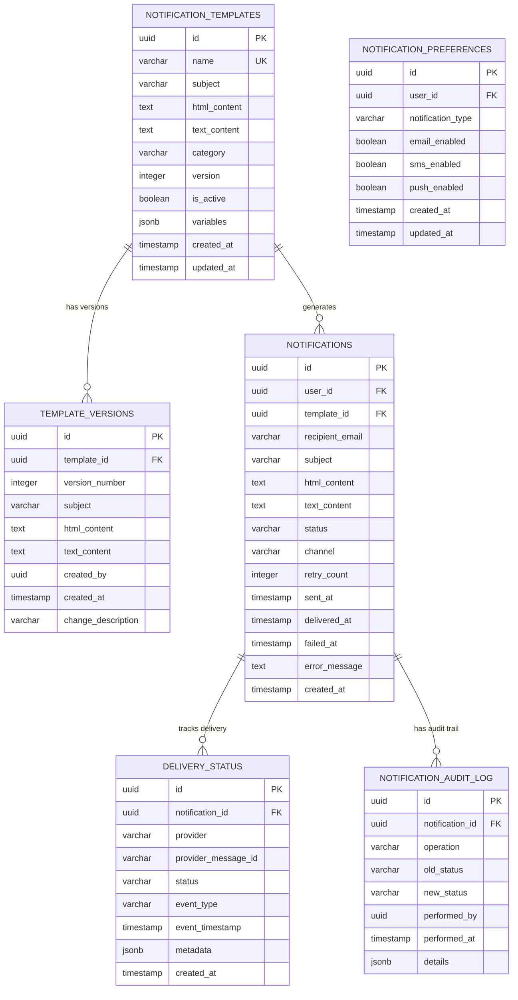
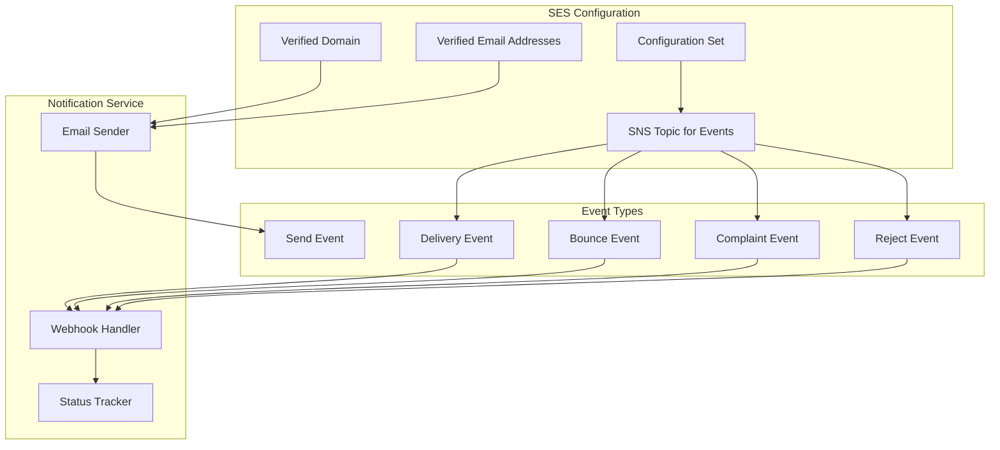
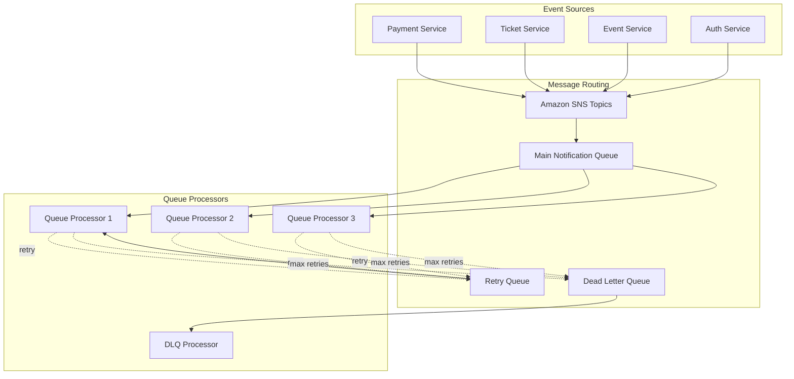

# Notification Service - Detailed Design Document

## Overview

The Notification Service is a critical microservice in the Event Ticket Booking System responsible for managing all communication with users through multiple channels. This service handles email notifications, template management, delivery tracking, and ensures reliable message delivery with retry mechanisms and failure handling.

### Key Responsibilities

- **Email Notification Management**: Sending transactional and promotional emails
- **Template Management**: Creating, versioning, and managing notification templates
- **Delivery Tracking**: Monitoring email delivery status and handling bounces/complaints
- **Asynchronous Processing**: Queue-based message processing for scalability
- **Multi-Channel Support**: Email, SMS (future), and push notifications (future)
- **Retry Mechanisms**: Automatic retry for failed deliveries with exponential backoff

### Design Principles

- **Reliability**: Guaranteed message delivery with retry mechanisms
- **Scalability**: Asynchronous processing to handle high message volumes
- **Observability**: Complete tracking of notification lifecycle
- **Template Versioning**: Support for A/B testing and gradual rollouts
- **Compliance**: GDPR compliance and user preference management
- **Performance**: Sub-2-minute delivery for critical notifications

## Service Architecture

### Component Overview




### Component Interactions

#### Notification Controller Layer
- **REST API Endpoints**: Handles HTTP requests for notification operations
- **Input Validation**: Request parameter validation and sanitization
- **Authentication**: JWT token validation through Auth Service
- **Rate Limiting**: API throttling to prevent abuse
- **Error Handling**: Standardized error responses

#### Notification Service Layer
- **Business Logic**: Core notification orchestration
- **Template Resolution**: Selecting appropriate templates based on context
- **Data Enrichment**: Fetching additional data from other services
- **Delivery Coordination**: Managing multi-channel delivery
- **Status Tracking**: Monitoring notification lifecycle

#### Template Engine
- **Template Rendering**: Processing templates with dynamic data
- **Variable Substitution**: Replacing placeholders with actual values
- **HTML/Text Generation**: Creating both HTML and plain text versions
- **Localization Support**: Multi-language template rendering
- **Preview Generation**: Template preview for testing

#### Delivery Manager
- **Channel Selection**: Choosing appropriate delivery channel
- **Provider Management**: Managing multiple email service providers
- **Failover Logic**: Automatic failover to backup providers
- **Batch Processing**: Grouping messages for efficient delivery
- **Delivery Confirmation**: Tracking successful deliveries

#### Queue Processor
- **Message Consumption**: Processing messages from SQS queues
- **Concurrent Processing**: Parallel message handling
- **Error Handling**: Managing processing failures
- **Idempotency**: Preventing duplicate message processing
- **Metrics Collection**: Tracking processing performance

#### Retry Handler
- **Exponential Backoff**: Implementing retry delays
- **Retry Limits**: Maximum retry attempts configuration
- **Dead Letter Queue**: Moving failed messages after max retries
- **Failure Analysis**: Categorizing failure types
- **Alert Generation**: Notifying on persistent failures

## Data Flow Diagrams

### Email Notification Flow




### Retry and Failure Handling Flow



### Template Management Flow



## Database Schema Documentation

### Core Entity Relationships




### Database Schema with Delivery Tracking

```sql
-- Notification templates with versioning
CREATE TABLE notification_templates (
    id UUID PRIMARY KEY DEFAULT gen_random_uuid(),
    name VARCHAR(100) UNIQUE NOT NULL,
    subject VARCHAR(255) NOT NULL,
    html_content TEXT NOT NULL,
    text_content TEXT NOT NULL,
    category VARCHAR(50) CHECK (category IN (
        'TRANSACTIONAL', 'PROMOTIONAL', 'SYSTEM', 'REMINDER'
    )),
    version INTEGER DEFAULT 1 NOT NULL,
    is_active BOOLEAN DEFAULT TRUE,
    variables JSONB, -- Expected template variables
    created_at TIMESTAMP DEFAULT CURRENT_TIMESTAMP,
    updated_at TIMESTAMP DEFAULT CURRENT_TIMESTAMP,
    created_by UUID NOT NULL
);

-- Indexes for template queries
CREATE INDEX idx_templates_name ON notification_templates(name);
CREATE INDEX idx_templates_category ON notification_templates(category);
CREATE INDEX idx_templates_active ON notification_templates(is_active) WHERE is_active = TRUE;

-- Template version history
CREATE TABLE template_versions (
    id UUID PRIMARY KEY DEFAULT gen_random_uuid(),
    template_id UUID NOT NULL REFERENCES notification_templates(id) ON DELETE CASCADE,
    version_number INTEGER NOT NULL,
    subject VARCHAR(255) NOT NULL,
    html_content TEXT NOT NULL,
    text_content TEXT NOT NULL,
    created_by UUID NOT NULL,
    created_at TIMESTAMP DEFAULT CURRENT_TIMESTAMP,
    change_description TEXT,
    
    CONSTRAINT unique_template_version UNIQUE (template_id, version_number)
);

-- Indexes for version queries
CREATE INDEX idx_template_versions_template ON template_versions(template_id, version_number DESC);

-- Notifications with delivery tracking
CREATE TABLE notifications (
    id UUID PRIMARY KEY DEFAULT gen_random_uuid(),
    user_id UUID NOT NULL,
    template_id UUID REFERENCES notification_templates(id),
    recipient_email VARCHAR(255) NOT NULL,
    subject VARCHAR(255) NOT NULL,
    html_content TEXT,
    text_content TEXT,
    status VARCHAR(50) DEFAULT 'PENDING' CHECK (status IN (
        'PENDING', 'QUEUED', 'PROCESSING', 'SENT', 'DELIVERED', 
        'FAILED', 'BOUNCED', 'COMPLAINED', 'PERMANENTLY_FAILED'
    )),
    channel VARCHAR(20) DEFAULT 'EMAIL' CHECK (channel IN ('EMAIL', 'SMS', 'PUSH')),
    retry_count INTEGER DEFAULT 0,
    max_retries INTEGER DEFAULT 3,
    sent_at TIMESTAMP,
    delivered_at TIMESTAMP,
    failed_at TIMESTAMP,
    error_message TEXT,
    error_code VARCHAR(50),
    metadata JSONB, -- Additional context data
    created_at TIMESTAMP DEFAULT CURRENT_TIMESTAMP,
    updated_at TIMESTAMP DEFAULT CURRENT_TIMESTAMP
);

-- Indexes for notification queries
CREATE INDEX idx_notifications_user_id ON notifications(user_id);
CREATE INDEX idx_notifications_status ON notifications(status);
CREATE INDEX idx_notifications_created_at ON notifications(created_at DESC);
CREATE INDEX idx_notifications_recipient ON notifications(recipient_email);
CREATE INDEX idx_notifications_retry ON notifications(status, retry_count) 
    WHERE status IN ('FAILED', 'PENDING') AND retry_count < max_retries;

-- Delivery status tracking
CREATE TABLE delivery_status (
    id UUID PRIMARY KEY DEFAULT gen_random_uuid(),
    notification_id UUID NOT NULL REFERENCES notifications(id) ON DELETE CASCADE,
    provider VARCHAR(50) NOT NULL, -- SES, SendGrid, etc.
    provider_message_id VARCHAR(255),
    status VARCHAR(50) NOT NULL,
    event_type VARCHAR(50), -- send, delivery, bounce, complaint, etc.
    event_timestamp TIMESTAMP NOT NULL,
    metadata JSONB, -- Provider-specific data
    created_at TIMESTAMP DEFAULT CURRENT_TIMESTAMP
);

-- Indexes for delivery tracking
CREATE INDEX idx_delivery_notification ON delivery_status(notification_id, event_timestamp DESC);
CREATE INDEX idx_delivery_provider_id ON delivery_status(provider_message_id);
CREATE INDEX idx_delivery_event_type ON delivery_status(event_type);

-- User notification preferences
CREATE TABLE notification_preferences (
    id UUID PRIMARY KEY DEFAULT gen_random_uuid(),
    user_id UUID NOT NULL,
    notification_type VARCHAR(50) NOT NULL,
    email_enabled BOOLEAN DEFAULT TRUE,
    sms_enabled BOOLEAN DEFAULT FALSE,
    push_enabled BOOLEAN DEFAULT FALSE,
    created_at TIMESTAMP DEFAULT CURRENT_TIMESTAMP,
    updated_at TIMESTAMP DEFAULT CURRENT_TIMESTAMP,
    
    CONSTRAINT unique_user_notification_type UNIQUE (user_id, notification_type)
);

-- Indexes for preference queries
CREATE INDEX idx_preferences_user ON notification_preferences(user_id);

-- Notification audit log
CREATE TABLE notification_audit_log (
    id UUID PRIMARY KEY DEFAULT gen_random_uuid(),
    notification_id UUID REFERENCES notifications(id),
    operation VARCHAR(50) NOT NULL,
    old_status VARCHAR(50),
    new_status VARCHAR(50),
    performed_by UUID,
    performed_at TIMESTAMP DEFAULT CURRENT_TIMESTAMP,
    details JSONB,
    ip_address INET,
    user_agent TEXT
);

-- Index for audit queries
CREATE INDEX idx_audit_notification ON notification_audit_log(notification_id, performed_at DESC);
CREATE INDEX idx_audit_performed_at ON notification_audit_log(performed_at DESC);
```


### Database Triggers for Audit Trail

```sql
-- Trigger function for notification audit logging
CREATE OR REPLACE FUNCTION audit_notification_changes()
RETURNS TRIGGER AS $$
BEGIN
    IF TG_OP = 'UPDATE' THEN
        INSERT INTO notification_audit_log (
            notification_id, operation, old_status, new_status, 
            performed_by, details
        ) VALUES (
            NEW.id, 
            'NOTIFICATION_UPDATE', 
            OLD.status, 
            NEW.status,
            COALESCE(current_setting('app.current_user_id', true)::UUID, 
                     '00000000-0000-0000-0000-000000000000'),
            jsonb_build_object(
                'old_retry_count', OLD.retry_count,
                'new_retry_count', NEW.retry_count,
                'error_message', NEW.error_message
            )
        );
        RETURN NEW;
    ELSIF TG_OP = 'INSERT' THEN
        INSERT INTO notification_audit_log (
            notification_id, operation, new_status, 
            performed_by, details
        ) VALUES (
            NEW.id, 
            'NOTIFICATION_CREATE', 
            NEW.status,
            COALESCE(current_setting('app.current_user_id', true)::UUID, 
                     '00000000-0000-0000-0000-000000000000'),
            jsonb_build_object(
                'recipient', NEW.recipient_email,
                'template_id', NEW.template_id,
                'channel', NEW.channel
            )
        );
        RETURN NEW;
    END IF;
    RETURN NULL;
END;
$$ LANGUAGE plpgsql;

-- Apply trigger to notifications table
CREATE TRIGGER notification_audit_trigger
    AFTER INSERT OR UPDATE ON notifications
    FOR EACH ROW EXECUTE FUNCTION audit_notification_changes();

-- Trigger to update template version on changes
CREATE OR REPLACE FUNCTION update_template_version()
RETURNS TRIGGER AS $$
BEGIN
    -- Archive current version
    INSERT INTO template_versions (
        template_id, version_number, subject, 
        html_content, text_content, created_by
    ) VALUES (
        OLD.id, OLD.version, OLD.subject,
        OLD.html_content, OLD.text_content,
        COALESCE(current_setting('app.current_user_id', true)::UUID, 
                 '00000000-0000-0000-0000-000000000000')
    );
    
    -- Increment version
    NEW.version = OLD.version + 1;
    NEW.updated_at = CURRENT_TIMESTAMP;
    
    RETURN NEW;
END;
$$ LANGUAGE plpgsql;

-- Apply trigger to templates table
CREATE TRIGGER template_version_trigger
    BEFORE UPDATE ON notification_templates
    FOR EACH ROW 
    WHEN (OLD.html_content IS DISTINCT FROM NEW.html_content OR 
          OLD.text_content IS DISTINCT FROM NEW.text_content OR
          OLD.subject IS DISTINCT FROM NEW.subject)
    EXECUTE FUNCTION update_template_version();
```

## Data Models

### Core Entities

#### NotificationTemplate Entity
```java
@Entity
@Table(name = "notification_templates")
public class NotificationTemplate {
    @Id
    @GeneratedValue(strategy = GenerationType.UUID)
    private UUID id;
    
    @Column(unique = true, nullable = false, length = 100)
    private String name;
    
    @Column(nullable = false, length = 255)
    private String subject;
    
    @Column(name = "html_content", nullable = false, columnDefinition = "TEXT")
    private String htmlContent;
    
    @Column(name = "text_content", nullable = false, columnDefinition = "TEXT")
    private String textContent;
    
    @Enumerated(EnumType.STRING)
    @Column(length = 50)
    private TemplateCategory category;
    
    @Column(nullable = false)
    private Integer version = 1;
    
    @Column(name = "is_active")
    private Boolean isActive = true;
    
    @Type(JsonBinaryType.class)
    @Column(columnDefinition = "jsonb")
    private Map<String, String> variables; // Expected variables with descriptions
    
    @CreationTimestamp
    @Column(name = "created_at")
    private LocalDateTime createdAt;
    
    @UpdateTimestamp
    @Column(name = "updated_at")
    private LocalDateTime updatedAt;
    
    @Column(name = "created_by", nullable = false)
    private UUID createdBy;
    
    // Getters, setters, constructors
}
```

#### Notification Entity
```java
@Entity
@Table(name = "notifications")
public class Notification {
    @Id
    @GeneratedValue(strategy = GenerationType.UUID)
    private UUID id;
    
    @Column(name = "user_id", nullable = false)
    private UUID userId;
    
    @ManyToOne(fetch = FetchType.LAZY)
    @JoinColumn(name = "template_id")
    private NotificationTemplate template;
    
    @Column(name = "recipient_email", nullable = false, length = 255)
    private String recipientEmail;
    
    @Column(nullable = false, length = 255)
    private String subject;
    
    @Column(name = "html_content", columnDefinition = "TEXT")
    private String htmlContent;
    
    @Column(name = "text_content", columnDefinition = "TEXT")
    private String textContent;
    
    @Enumerated(EnumType.STRING)
    @Column(length = 50)
    private NotificationStatus status = NotificationStatus.PENDING;
    
    @Enumerated(EnumType.STRING)
    @Column(length = 20)
    private NotificationChannel channel = NotificationChannel.EMAIL;
    
    @Column(name = "retry_count")
    private Integer retryCount = 0;
    
    @Column(name = "max_retries")
    private Integer maxRetries = 3;
    
    @Column(name = "sent_at")
    private Instant sentAt;
    
    @Column(name = "delivered_at")
    private Instant deliveredAt;
    
    @Column(name = "failed_at")
    private Instant failedAt;
    
    @Column(name = "error_message", columnDefinition = "TEXT")
    private String errorMessage;
    
    @Column(name = "error_code", length = 50)
    private String errorCode;
    
    @Type(JsonBinaryType.class)
    @Column(columnDefinition = "jsonb")
    private Map<String, Object> metadata;
    
    @CreationTimestamp
    @Column(name = "created_at")
    private LocalDateTime createdAt;
    
    @UpdateTimestamp
    @Column(name = "updated_at")
    private LocalDateTime updatedAt;
    
    // Getters, setters, constructors
}
```


#### DeliveryStatus Entity
```java
@Entity
@Table(name = "delivery_status")
public class DeliveryStatus {
    @Id
    @GeneratedValue(strategy = GenerationType.UUID)
    private UUID id;
    
    @Column(name = "notification_id", nullable = false)
    private UUID notificationId;
    
    @Column(nullable = false, length = 50)
    private String provider; // SES, SendGrid, etc.
    
    @Column(name = "provider_message_id", length = 255)
    private String providerMessageId;
    
    @Column(nullable = false, length = 50)
    private String status;
    
    @Column(name = "event_type", length = 50)
    private String eventType; // send, delivery, bounce, complaint
    
    @Column(name = "event_timestamp", nullable = false)
    private Instant eventTimestamp;
    
    @Type(JsonBinaryType.class)
    @Column(columnDefinition = "jsonb")
    private Map<String, Object> metadata;
    
    @CreationTimestamp
    @Column(name = "created_at")
    private LocalDateTime createdAt;
    
    // Getters, setters, constructors
}
```

### Enums

#### NotificationStatus
```java
public enum NotificationStatus {
    PENDING,
    QUEUED,
    PROCESSING,
    SENT,
    DELIVERED,
    FAILED,
    BOUNCED,
    COMPLAINED,
    PERMANENTLY_FAILED
}
```

#### NotificationChannel
```java
public enum NotificationChannel {
    EMAIL,
    SMS,
    PUSH
}
```

#### TemplateCategory
```java
public enum TemplateCategory {
    TRANSACTIONAL,
    PROMOTIONAL,
    SYSTEM,
    REMINDER
}
```

## API Specifications

### REST Endpoints

#### Template Management Endpoints

**Create Template**
```http
POST /api/notifications/templates
Authorization: Bearer {admin_jwt_token}
Content-Type: application/json

{
  "name": "ORDER_CONFIRMATION",
  "subject": "Order Confirmation - {{orderNumber}}",
  "htmlContent": "<html>...</html>",
  "textContent": "Your order {{orderNumber}} has been confirmed...",
  "category": "TRANSACTIONAL",
  "variables": {
    "orderNumber": "Order number",
    "customerName": "Customer name",
    "totalAmount": "Total order amount",
    "orderItems": "List of order items"
  }
}
```

**Response:**
```json
{
  "success": true,
  "data": {
    "id": "550e8400-e29b-41d4-a716-446655440000",
    "name": "ORDER_CONFIRMATION",
    "subject": "Order Confirmation - {{orderNumber}}",
    "category": "TRANSACTIONAL",
    "version": 1,
    "isActive": true,
    "createdAt": "2024-01-15T10:30:00Z"
  }
}
```

**Get Template**
```http
GET /api/notifications/templates/{templateId}
Authorization: Bearer {jwt_token}
```

**Update Template**
```http
PUT /api/notifications/templates/{templateId}
Authorization: Bearer {admin_jwt_token}
Content-Type: application/json
```

**List Templates**
```http
GET /api/notifications/templates?category=TRANSACTIONAL&active=true&page=0&size=20
Authorization: Bearer {jwt_token}
```

**Get Template Versions**
```http
GET /api/notifications/templates/{templateId}/versions
Authorization: Bearer {admin_jwt_token}
```

#### Notification Management Endpoints

**Send Notification**
```http
POST /api/notifications/send
Authorization: Bearer {jwt_token}
Content-Type: application/json

{
  "templateName": "ORDER_CONFIRMATION",
  "recipientEmail": "user@example.com",
  "userId": "123e4567-e89b-12d3-a456-426614174000",
  "variables": {
    "orderNumber": "ORD-2024-001",
    "customerName": "John Doe",
    "totalAmount": "$150.00",
    "orderItems": [
      {"name": "VIP Ticket", "quantity": 2, "price": "$75.00"}
    ]
  },
  "metadata": {
    "orderId": "456e7890-e89b-12d3-a456-426614174001",
    "eventId": "789e0123-e89b-12d3-a456-426614174002"
  }
}
```

**Response:**
```json
{
  "success": true,
  "data": {
    "notificationId": "abc12345-e89b-12d3-a456-426614174003",
    "status": "QUEUED",
    "recipientEmail": "user@example.com",
    "createdAt": "2024-01-15T10:30:00Z"
  }
}
```

**Get Notification Status**
```http
GET /api/notifications/{notificationId}/status
Authorization: Bearer {jwt_token}
```

**Response:**
```json
{
  "success": true,
  "data": {
    "notificationId": "abc12345-e89b-12d3-a456-426614174003",
    "status": "DELIVERED",
    "recipientEmail": "user@example.com",
    "sentAt": "2024-01-15T10:30:15Z",
    "deliveredAt": "2024-01-15T10:30:45Z",
    "retryCount": 0,
    "deliveryHistory": [
      {
        "provider": "SES",
        "eventType": "send",
        "timestamp": "2024-01-15T10:30:15Z"
      },
      {
        "provider": "SES",
        "eventType": "delivery",
        "timestamp": "2024-01-15T10:30:45Z"
      }
    ]
  }
}
```

**Get User Notifications**
```http
GET /api/notifications/user/{userId}?status=DELIVERED&page=0&size=20
Authorization: Bearer {jwt_token}
```

**Resend Notification**
```http
POST /api/notifications/{notificationId}/resend
Authorization: Bearer {jwt_token}
```

#### Preference Management Endpoints

**Get User Preferences**
```http
GET /api/notifications/preferences/{userId}
Authorization: Bearer {jwt_token}
```

**Update Preferences**
```http
PUT /api/notifications/preferences/{userId}
Authorization: Bearer {jwt_token}
Content-Type: application/json

{
  "preferences": [
    {
      "notificationType": "ORDER_CONFIRMATION",
      "emailEnabled": true,
      "smsEnabled": false,
      "pushEnabled": true
    },
    {
      "notificationType": "EVENT_REMINDER",
      "emailEnabled": true,
      "smsEnabled": true,
      "pushEnabled": true
    }
  ]
}
```


## Amazon SES Integration Architecture

### SES Configuration and Setup



### SES Integration Implementation

```java
@Service
@Slf4j
public class SESEmailService implements EmailService {
    
    private final SesClient sesClient;
    private final NotificationRepository notificationRepository;
    private final DeliveryStatusRepository deliveryStatusRepository;
    
    @Value("${aws.ses.from-email}")
    private String fromEmail;
    
    @Value("${aws.ses.configuration-set}")
    private String configurationSet;
    
    @Value("${aws.ses.region}")
    private String region;
    
    @PostConstruct
    public void init() {
        this.sesClient = SesClient.builder()
            .region(Region.of(region))
            .build();
    }
    
    @Override
    public SendEmailResult sendEmail(Notification notification) {
        try {
            // Build email content
            Content subject = Content.builder()
                .data(notification.getSubject())
                .charset("UTF-8")
                .build();
            
            Body body = Body.builder()
                .html(Content.builder()
                    .data(notification.getHtmlContent())
                    .charset("UTF-8")
                    .build())
                .text(Content.builder()
                    .data(notification.getTextContent())
                    .charset("UTF-8")
                    .build())
                .build();
            
            Message message = Message.builder()
                .subject(subject)
                .body(body)
                .build();
            
            // Build destination
            Destination destination = Destination.builder()
                .toAddresses(notification.getRecipientEmail())
                .build();
            
            // Build send request with configuration set for tracking
            SendEmailRequest emailRequest = SendEmailRequest.builder()
                .source(fromEmail)
                .destination(destination)
                .message(message)
                .configurationSetName(configurationSet)
                .tags(
                    MessageTag.builder()
                        .name("notification_id")
                        .value(notification.getId().toString())
                        .build(),
                    MessageTag.builder()
                        .name("user_id")
                        .value(notification.getUserId().toString())
                        .build()
                )
                .build();
            
            // Send email
            SendEmailResponse response = sesClient.sendEmail(emailRequest);
            
            // Update notification status
            notification.setStatus(NotificationStatus.SENT);
            notification.setSentAt(Instant.now());
            notificationRepository.save(notification);
            
            // Record delivery status
            DeliveryStatus deliveryStatus = DeliveryStatus.builder()
                .notificationId(notification.getId())
                .provider("SES")
                .providerMessageId(response.messageId())
                .status("SENT")
                .eventType("send")
                .eventTimestamp(Instant.now())
                .build();
            deliveryStatusRepository.save(deliveryStatus);
            
            log.info("Email sent successfully via SES. MessageId: {}, NotificationId: {}", 
                     response.messageId(), notification.getId());
            
            return SendEmailResult.builder()
                .success(true)
                .messageId(response.messageId())
                .provider("SES")
                .build();
            
        } catch (SesException e) {
            log.error("Failed to send email via SES for notification {}", 
                      notification.getId(), e);
            
            // Update notification with error
            notification.setStatus(NotificationStatus.FAILED);
            notification.setFailedAt(Instant.now());
            notification.setErrorMessage(e.awsErrorDetails().errorMessage());
            notification.setErrorCode(e.awsErrorDetails().errorCode());
            notification.setRetryCount(notification.getRetryCount() + 1);
            notificationRepository.save(notification);
            
            return SendEmailResult.builder()
                .success(false)
                .errorMessage(e.awsErrorDetails().errorMessage())
                .errorCode(e.awsErrorDetails().errorCode())
                .build();
        }
    }
    
    @Override
    public void handleSESWebhook(SESEvent sesEvent) {
        for (SESEvent.SESRecord record : sesEvent.getRecords()) {
            SESEvent.SESMessage sesMessage = record.getSes();
            
            switch (record.getEventType()) {
                case "Delivery":
                    handleDeliveryEvent(sesMessage);
                    break;
                case "Bounce":
                    handleBounceEvent(sesMessage);
                    break;
                case "Complaint":
                    handleComplaintEvent(sesMessage);
                    break;
                case "Reject":
                    handleRejectEvent(sesMessage);
                    break;
                default:
                    log.debug("Unhandled SES event type: {}", record.getEventType());
            }
        }
    }
    
    private void handleDeliveryEvent(SESEvent.SESMessage sesMessage) {
        String messageId = sesMessage.getMail().getMessageId();
        
        // Find notification by provider message ID
        DeliveryStatus lastStatus = deliveryStatusRepository
            .findTopByProviderMessageIdOrderByEventTimestampDesc(messageId)
            .orElse(null);
        
        if (lastStatus != null) {
            Notification notification = notificationRepository
                .findById(lastStatus.getNotificationId())
                .orElse(null);
            
            if (notification != null) {
                // Update notification status
                notification.setStatus(NotificationStatus.DELIVERED);
                notification.setDeliveredAt(Instant.now());
                notificationRepository.save(notification);
                
                // Record delivery event
                DeliveryStatus deliveryStatus = DeliveryStatus.builder()
                    .notificationId(notification.getId())
                    .provider("SES")
                    .providerMessageId(messageId)
                    .status("DELIVERED")
                    .eventType("delivery")
                    .eventTimestamp(Instant.now())
                    .metadata(Map.of(
                        "processingTimeMillis", sesMessage.getDelivery().getProcessingTimeMillis(),
                        "smtpResponse", sesMessage.getDelivery().getSmtpResponse()
                    ))
                    .build();
                deliveryStatusRepository.save(deliveryStatus);
                
                log.info("Email delivered successfully. NotificationId: {}, MessageId: {}", 
                         notification.getId(), messageId);
            }
        }
    }
    
    private void handleBounceEvent(SESEvent.SESMessage sesMessage) {
        String messageId = sesMessage.getMail().getMessageId();
        SESEvent.Bounce bounce = sesMessage.getBounce();
        
        DeliveryStatus lastStatus = deliveryStatusRepository
            .findTopByProviderMessageIdOrderByEventTimestampDesc(messageId)
            .orElse(null);
        
        if (lastStatus != null) {
            Notification notification = notificationRepository
                .findById(lastStatus.getNotificationId())
                .orElse(null);
            
            if (notification != null) {
                // Update notification status
                notification.setStatus(NotificationStatus.BOUNCED);
                notification.setFailedAt(Instant.now());
                notification.setErrorMessage("Email bounced: " + bounce.getBounceType());
                notificationRepository.save(notification);
                
                // Record bounce event
                DeliveryStatus deliveryStatus = DeliveryStatus.builder()
                    .notificationId(notification.getId())
                    .provider("SES")
                    .providerMessageId(messageId)
                    .status("BOUNCED")
                    .eventType("bounce")
                    .eventTimestamp(Instant.now())
                    .metadata(Map.of(
                        "bounceType", bounce.getBounceType(),
                        "bounceSubType", bounce.getBounceSubType(),
                        "bouncedRecipients", bounce.getBouncedRecipients()
                    ))
                    .build();
                deliveryStatusRepository.save(deliveryStatus);
                
                log.warn("Email bounced. NotificationId: {}, BounceType: {}", 
                         notification.getId(), bounce.getBounceType());
                
                // Handle permanent bounces
                if ("Permanent".equals(bounce.getBounceType())) {
                    notification.setStatus(NotificationStatus.PERMANENTLY_FAILED);
                    notificationRepository.save(notification);
                    // TODO: Add email to suppression list
                }
            }
        }
    }
    
    private void handleComplaintEvent(SESEvent.SESMessage sesMessage) {
        String messageId = sesMessage.getMail().getMessageId();
        
        DeliveryStatus lastStatus = deliveryStatusRepository
            .findTopByProviderMessageIdOrderByEventTimestampDesc(messageId)
            .orElse(null);
        
        if (lastStatus != null) {
            Notification notification = notificationRepository
                .findById(lastStatus.getNotificationId())
                .orElse(null);
            
            if (notification != null) {
                // Update notification status
                notification.setStatus(NotificationStatus.COMPLAINED);
                notificationRepository.save(notification);
                
                // Record complaint event
                DeliveryStatus deliveryStatus = DeliveryStatus.builder()
                    .notificationId(notification.getId())
                    .provider("SES")
                    .providerMessageId(messageId)
                    .status("COMPLAINED")
                    .eventType("complaint")
                    .eventTimestamp(Instant.now())
                    .build();
                deliveryStatusRepository.save(deliveryStatus);
                
                log.warn("Complaint received for notification: {}", notification.getId());
                // TODO: Add email to suppression list and notify admin
            }
        }
    }
}
```


## SQS Message Processing for Asynchronous Notifications

### Queue Architecture



### Message Format

```json
{
  "eventType": "ORDER_CONFIRMED",
  "eventId": "evt_123456789",
  "timestamp": "2024-01-15T10:30:00Z",
  "source": "payment-service",
  "data": {
    "orderId": "550e8400-e29b-41d4-a716-446655440000",
    "userId": "6ba7b810-9dad-11d1-80b4-00c04fd430c8",
    "userEmail": "user@example.com",
    "orderNumber": "ORD-2024-001",
    "totalAmount": 150.00,
    "currency": "USD",
    "orderItems": [
      {
        "ticketTypeId": "789e0123-e89b-12d3-a456-426614174002",
        "ticketTypeName": "VIP Ticket",
        "quantity": 2,
        "unitPrice": 75.00
      }
    ],
    "eventId": "abc12345-e89b-12d3-a456-426614174003",
    "eventName": "Summer Music Festival",
    "eventDate": "2024-07-15T18:00:00Z"
  },
  "metadata": {
    "correlationId": "corr_987654321",
    "retryCount": 0,
    "priority": "HIGH"
  }
}
```

### SQS Queue Processor Implementation

```java
@Service
@Slf4j
public class NotificationQueueProcessor {
    
    private final SqsClient sqsClient;
    private final NotificationService notificationService;
    private final ObjectMapper objectMapper;
    
    @Value("${aws.sqs.notification-queue-url}")
    private String queueUrl;
    
    @Value("${aws.sqs.retry-queue-url}")
    private String retryQueueUrl;
    
    @Value("${aws.sqs.dlq-url}")
    private String dlqUrl;
    
    @Value("${notification.processing.batch-size:10}")
    private int batchSize;
    
    @Value("${notification.processing.visibility-timeout:30}")
    private int visibilityTimeout;
    
    @Scheduled(fixedDelay = 1000) // Poll every second
    public void processMessages() {
        try {
            ReceiveMessageRequest receiveRequest = ReceiveMessageRequest.builder()
                .queueUrl(queueUrl)
                .maxNumberOfMessages(batchSize)
                .visibilityTimeout(visibilityTimeout)
                .waitTimeSeconds(20) // Long polling
                .messageAttributeNames("All")
                .build();
            
            ReceiveMessageResponse response = sqsClient.receiveMessage(receiveRequest);
            
            if (!response.messages().isEmpty()) {
                log.info("Received {} messages from notification queue", response.messages().size());
                
                // Process messages in parallel
                response.messages().parallelStream()
                    .forEach(this::processMessage);
            }
            
        } catch (Exception e) {
            log.error("Error processing notification queue", e);
        }
    }
    
    private void processMessage(Message message) {
        String receiptHandle = message.receiptHandle();
        
        try {
            // Parse message
            NotificationEvent event = objectMapper.readValue(
                message.body(), 
                NotificationEvent.class
            );
            
            log.info("Processing notification event: {} for user: {}", 
                     event.getEventType(), event.getData().getUserId());
            
            // Check for duplicate processing (idempotency)
            if (isDuplicateMessage(event.getEventId())) {
                log.warn("Duplicate message detected: {}", event.getEventId());
                deleteMessage(receiptHandle);
                return;
            }
            
            // Process notification based on event type
            boolean success = processNotificationEvent(event);
            
            if (success) {
                // Delete message from queue
                deleteMessage(receiptHandle);
                log.info("Successfully processed notification event: {}", event.getEventId());
            } else {
                // Handle retry logic
                handleRetry(message, event);
            }
            
        } catch (Exception e) {
            log.error("Error processing message: {}", message.messageId(), e);
            handleRetry(message, null);
        }
    }
    
    private boolean processNotificationEvent(NotificationEvent event) {
        try {
            switch (event.getEventType()) {
                case "ORDER_CONFIRMED":
                    return notificationService.sendOrderConfirmation(event.getData());
                    
                case "TICKET_GENERATED":
                    return notificationService.sendTicketDelivery(event.getData());
                    
                case "EVENT_CANCELLED":
                    return notificationService.sendEventCancellation(event.getData());
                    
                case "EVENT_REMINDER":
                    return notificationService.sendEventReminder(event.getData());
                    
                case "PASSWORD_RESET":
                    return notificationService.sendPasswordReset(event.getData());
                    
                case "EMAIL_VERIFICATION":
                    return notificationService.sendEmailVerification(event.getData());
                    
                default:
                    log.warn("Unknown event type: {}", event.getEventType());
                    return false;
            }
        } catch (Exception e) {
            log.error("Error processing notification event: {}", event.getEventType(), e);
            return false;
        }
    }
    
    private void handleRetry(Message message, NotificationEvent event) {
        try {
            // Get retry count from message attributes
            int retryCount = getRetryCount(message);
            int maxRetries = 3;
            
            if (retryCount < maxRetries) {
                // Calculate exponential backoff delay
                int delaySeconds = calculateBackoffDelay(retryCount);
                
                // Send to retry queue with delay
                SendMessageRequest retryRequest = SendMessageRequest.builder()
                    .queueUrl(retryQueueUrl)
                    .messageBody(message.body())
                    .delaySeconds(delaySeconds)
                    .messageAttributes(Map.of(
                        "RetryCount", MessageAttributeValue.builder()
                            .dataType("Number")
                            .stringValue(String.valueOf(retryCount + 1))
                            .build(),
                        "OriginalMessageId", MessageAttributeValue.builder()
                            .dataType("String")
                            .stringValue(message.messageId())
                            .build()
                    ))
                    .build();
                
                sqsClient.sendMessage(retryRequest);
                
                log.info("Message sent to retry queue with delay {}s. Retry: {}/{}", 
                         delaySeconds, retryCount + 1, maxRetries);
                
            } else {
                // Max retries exceeded, send to DLQ
                SendMessageRequest dlqRequest = SendMessageRequest.builder()
                    .queueUrl(dlqUrl)
                    .messageBody(message.body())
                    .messageAttributes(Map.of(
                        "FailureReason", MessageAttributeValue.builder()
                            .dataType("String")
                            .stringValue("Max retries exceeded")
                            .build(),
                        "OriginalMessageId", MessageAttributeValue.builder()
                            .dataType("String")
                            .stringValue(message.messageId())
                            .build()
                    ))
                    .build();
                
                sqsClient.sendMessage(dlqRequest);
                
                log.error("Message moved to DLQ after {} retries: {}", 
                          maxRetries, message.messageId());
                
                // Alert on DLQ message
                alertOnDLQMessage(message, event);
            }
            
            // Delete original message
            deleteMessage(message.receiptHandle());
            
        } catch (Exception e) {
            log.error("Error handling retry for message: {}", message.messageId(), e);
        }
    }
    
    private int getRetryCount(Message message) {
        MessageAttributeValue retryAttr = message.messageAttributes().get("RetryCount");
        if (retryAttr != null) {
            return Integer.parseInt(retryAttr.stringValue());
        }
        return 0;
    }
    
    private int calculateBackoffDelay(int retryCount) {
        // Exponential backoff: 2^retryCount * base delay
        int baseDelay = 5; // 5 seconds
        return (int) Math.pow(2, retryCount) * baseDelay;
    }
    
    private void deleteMessage(String receiptHandle) {
        DeleteMessageRequest deleteRequest = DeleteMessageRequest.builder()
            .queueUrl(queueUrl)
            .receiptHandle(receiptHandle)
            .build();
        
        sqsClient.deleteMessage(deleteRequest);
    }
    
    private boolean isDuplicateMessage(String eventId) {
        // Check if notification with this event ID already exists
        return notificationRepository.existsByMetadata_EventId(eventId);
    }
    
    private void alertOnDLQMessage(Message message, NotificationEvent event) {
        // Send alert to monitoring system
        log.error("ALERT: Message in DLQ - MessageId: {}, EventType: {}", 
                  message.messageId(), 
                  event != null ? event.getEventType() : "UNKNOWN");
        
        // TODO: Integrate with alerting system (CloudWatch, PagerDuty, etc.)
    }
}
```


## Template Engine Implementation

### Template Rendering System

```java
@Service
@Slf4j
public class TemplateEngineService {
    
    private final NotificationTemplateRepository templateRepository;
    private final RedisTemplate<String, String> redisTemplate;
    private final Handlebars handlebars;
    
    private static final String TEMPLATE_CACHE_KEY = "template:";
    private static final Duration TEMPLATE_CACHE_TTL = Duration.ofHours(24);
    
    public TemplateEngineService(NotificationTemplateRepository templateRepository,
                                  RedisTemplate<String, String> redisTemplate) {
        this.templateRepository = templateRepository;
        this.redisTemplate = redisTemplate;
        
        // Initialize Handlebars with custom helpers
        this.handlebars = new Handlebars();
        registerCustomHelpers();
    }
    
    public RenderedTemplate renderTemplate(String templateName, Map<String, Object> variables) {
        try {
            // Get template from cache or database
            NotificationTemplate template = getTemplate(templateName);
            
            if (template == null) {
                throw new TemplateNotFoundException("Template not found: " + templateName);
            }
            
            if (!template.getIsActive()) {
                throw new TemplateInactiveException("Template is inactive: " + templateName);
            }
            
            // Validate required variables
            validateVariables(template, variables);
            
            // Render HTML content
            Template htmlTemplate = handlebars.compileInline(template.getHtmlContent());
            String renderedHtml = htmlTemplate.apply(variables);
            
            // Render text content
            Template textTemplate = handlebars.compileInline(template.getTextContent());
            String renderedText = textTemplate.apply(variables);
            
            // Render subject
            Template subjectTemplate = handlebars.compileInline(template.getSubject());
            String renderedSubject = subjectTemplate.apply(variables);
            
            log.debug("Template rendered successfully: {}", templateName);
            
            return RenderedTemplate.builder()
                .templateId(template.getId())
                .templateName(templateName)
                .subject(renderedSubject)
                .htmlContent(renderedHtml)
                .textContent(renderedText)
                .build();
            
        } catch (IOException e) {
            log.error("Error rendering template: {}", templateName, e);
            throw new TemplateRenderException("Failed to render template: " + templateName, e);
        }
    }
    
    private NotificationTemplate getTemplate(String templateName) {
        // Try cache first
        String cacheKey = TEMPLATE_CACHE_KEY + templateName;
        String cachedTemplate = redisTemplate.opsForValue().get(cacheKey);
        
        if (cachedTemplate != null) {
            try {
                return objectMapper.readValue(cachedTemplate, NotificationTemplate.class);
            } catch (JsonProcessingException e) {
                log.warn("Failed to deserialize cached template: {}", templateName, e);
            }
        }
        
        // Load from database
        NotificationTemplate template = templateRepository
            .findByNameAndIsActiveTrue(templateName)
            .orElse(null);
        
        if (template != null) {
            // Cache template
            try {
                String serialized = objectMapper.writeValueAsString(template);
                redisTemplate.opsForValue().set(cacheKey, serialized, TEMPLATE_CACHE_TTL);
            } catch (JsonProcessingException e) {
                log.warn("Failed to cache template: {}", templateName, e);
            }
        }
        
        return template;
    }
    
    private void validateVariables(NotificationTemplate template, Map<String, Object> variables) {
        if (template.getVariables() == null || template.getVariables().isEmpty()) {
            return;
        }
        
        List<String> missingVariables = new ArrayList<>();
        
        for (String requiredVar : template.getVariables().keySet()) {
            if (!variables.containsKey(requiredVar)) {
                missingVariables.add(requiredVar);
            }
        }
        
        if (!missingVariables.isEmpty()) {
            throw new MissingTemplateVariablesException(
                "Missing required variables: " + String.join(", ", missingVariables)
            );
        }
    }
    
    private void registerCustomHelpers() {
        // Date formatting helper
        handlebars.registerHelper("formatDate", (context, options) -> {
            if (context == null) return "";
            
            String format = options.hash("format", "yyyy-MM-dd HH:mm:ss");
            
            if (context instanceof Instant) {
                return DateTimeFormatter.ofPattern(format)
                    .withZone(ZoneId.systemDefault())
                    .format((Instant) context);
            } else if (context instanceof LocalDateTime) {
                return ((LocalDateTime) context).format(DateTimeFormatter.ofPattern(format));
            }
            
            return context.toString();
        });
        
        // Currency formatting helper
        handlebars.registerHelper("formatCurrency", (context, options) -> {
            if (context == null) return "";
            
            String currency = options.hash("currency", "USD");
            
            NumberFormat formatter = NumberFormat.getCurrencyInstance();
            formatter.setCurrency(Currency.getInstance(currency));
            
            if (context instanceof Number) {
                return formatter.format(((Number) context).doubleValue());
            }
            
            return context.toString();
        });
        
        // Conditional helper
        handlebars.registerHelper("ifEquals", (context, options) -> {
            Object compareValue = options.param(0);
            
            if (context != null && context.equals(compareValue)) {
                return options.fn();
            } else {
                return options.inverse();
            }
        });
        
        // Loop helper with index
        handlebars.registerHelper("eachWithIndex", (context, options) -> {
            if (!(context instanceof Iterable)) {
                return "";
            }
            
            StringBuilder result = new StringBuilder();
            int index = 0;
            
            for (Object item : (Iterable<?>) context) {
                Context ctx = Context.newBuilder(item)
                    .combine("@index", index)
                    .combine("@first", index == 0)
                    .build();
                
                result.append(options.fn(ctx));
                index++;
            }
            
            return result.toString();
        });
    }
    
    public void invalidateTemplateCache(String templateName) {
        String cacheKey = TEMPLATE_CACHE_KEY + templateName;
        redisTemplate.delete(cacheKey);
        log.info("Template cache invalidated: {}", templateName);
    }
}
```

### Sample Email Templates

#### Order Confirmation Template

```html
<!DOCTYPE html>
<html>
<head>
    <meta charset="UTF-8">
    <meta name="viewport" content="width=device-width, initial-scale=1.0">
    <title>Order Confirmation</title>
    <style>
        body { font-family: Arial, sans-serif; line-height: 1.6; color: #333; }
        .container { max-width: 600px; margin: 0 auto; padding: 20px; }
        .header { background-color: #4CAF50; color: white; padding: 20px; text-align: center; }
        .content { padding: 20px; background-color: #f9f9f9; }
        .order-details { background-color: white; padding: 15px; margin: 20px 0; border-radius: 5px; }
        .ticket-item { border-bottom: 1px solid #ddd; padding: 10px 0; }
        .total { font-size: 18px; font-weight: bold; margin-top: 20px; }
        .button { display: inline-block; padding: 12px 24px; background-color: #4CAF50; 
                  color: white; text-decoration: none; border-radius: 5px; margin: 20px 0; }
        .footer { text-align: center; padding: 20px; color: #666; font-size: 12px; }
    </style>
</head>
<body>
    <div class="container">
        <div class="header">
            <h1>Order Confirmed!</h1>
        </div>
        
        <div class="content">
            <p>Hi {{customerName}},</p>
            
            <p>Thank you for your purchase! Your order has been confirmed and your tickets are ready.</p>
            
            <div class="order-details">
                <h2>Order Details</h2>
                <p><strong>Order Number:</strong> {{orderNumber}}</p>
                <p><strong>Order Date:</strong> {{formatDate orderDate format="MMMM dd, yyyy"}}</p>
                
                <h3>Event Information</h3>
                <p><strong>Event:</strong> {{eventName}}</p>
                <p><strong>Date:</strong> {{formatDate eventDate format="EEEE, MMMM dd, yyyy 'at' hh:mm a"}}</p>
                <p><strong>Venue:</strong> {{venueName}}</p>
                <p><strong>Address:</strong> {{venueAddress}}</p>
                
                <h3>Tickets</h3>
                {{#eachWithIndex orderItems}}
                <div class="ticket-item">
                    <p><strong>{{ticketTypeName}}</strong></p>
                    <p>Quantity: {{quantity}} × {{formatCurrency unitPrice currency="USD"}}</p>
                    <p>Subtotal: {{formatCurrency total currency="USD"}}</p>
                </div>
                {{/eachWithIndex}}
                
                <div class="total">
                    <p>Total: {{formatCurrency totalAmount currency="USD"}}</p>
                </div>
            </div>
            
            <p style="text-align: center;">
                <a href="{{ticketViewUrl}}" class="button">View Your Tickets</a>
            </p>
            
            <p>Your tickets have been sent as a separate email and are also available in your account.</p>
            
            <p>If you have any questions, please don't hesitate to contact our support team.</p>
            
            <p>See you at the event!</p>
        </div>
        
        <div class="footer">
            <p>© 2024 Event Ticket Booking System. All rights reserved.</p>
            <p>This is an automated message. Please do not reply to this email.</p>
        </div>
    </div>
</body>
</html>
```

#### Plain Text Version

```text
Order Confirmed!

Hi {{customerName}},

Thank you for your purchase! Your order has been confirmed and your tickets are ready.

ORDER DETAILS
-------------
Order Number: {{orderNumber}}
Order Date: {{formatDate orderDate format="MMMM dd, yyyy"}}

EVENT INFORMATION
-----------------
Event: {{eventName}}
Date: {{formatDate eventDate format="EEEE, MMMM dd, yyyy 'at' hh:mm a"}}
Venue: {{venueName}}
Address: {{venueAddress}}

TICKETS
-------
{{#each orderItems}}
{{ticketTypeName}}
Quantity: {{quantity}} × {{formatCurrency unitPrice currency="USD"}}
Subtotal: {{formatCurrency total currency="USD"}}

{{/each}}

Total: {{formatCurrency totalAmount currency="USD"}}

View your tickets: {{ticketViewUrl}}

Your tickets have been sent as a separate email and are also available in your account.

If you have any questions, please don't hesitate to contact our support team.

See you at the event!

---
© 2024 Event Ticket Booking System. All rights reserved.
This is an automated message. Please do not reply to this email.
```


## Integration Patterns

### Service-to-Service Communication

#### Authentication Service Integration

```java
@Service
public class NotificationService {
    
    @Autowired
    private AuthServiceClient authServiceClient;
    
    public boolean sendNotification(SendNotificationRequest request) {
        // Validate user exists and get user details
        UserDto user = authServiceClient.getUserById(request.getUserId());
        
        if (user == null) {
            throw new UserNotFoundException("User not found: " + request.getUserId());
        }
        
        // Check user notification preferences
        NotificationPreferences preferences = getNotificationPreferences(user.getId());
        
        if (!preferences.isEmailEnabled(request.getNotificationType())) {
            log.info("Email notifications disabled for user {} and type {}", 
                     user.getId(), request.getNotificationType());
            return false;
        }
        
        // Use user's email from auth service
        String recipientEmail = user.getEmail();
        
        // Process notification
        return processNotification(recipientEmail, request);
    }
}
```

#### Event Management Service Integration

```java
@Service
public class NotificationService {
    
    @Autowired
    private EventServiceClient eventServiceClient;
    
    public boolean sendEventReminder(EventReminderData data) {
        // Get event details from Event Service
        EventDto event = eventServiceClient.getEventById(data.getEventId());
        
        if (event == null) {
            throw new EventNotFoundException("Event not found: " + data.getEventId());
        }
        
        // Enrich notification data with event details
        Map<String, Object> variables = new HashMap<>();
        variables.put("eventName", event.getName());
        variables.put("eventDate", event.getEventDate());
        variables.put("venueName", event.getVenue().getName());
        variables.put("venueAddress", event.getVenue().getAddress());
        variables.put("eventDescription", event.getDescription());
        
        // Render and send notification
        return sendTemplatedNotification("EVENT_REMINDER", data.getUserEmail(), variables);
    }
}
```

#### Ticket Service Integration

```java
@Service
public class NotificationService {
    
    @Autowired
    private TicketServiceClient ticketServiceClient;
    
    public boolean sendTicketDelivery(TicketDeliveryData data) {
        // Get ticket details from Ticket Service
        List<TicketDto> tickets = ticketServiceClient.getTicketsByOrderId(data.getOrderId());
        
        if (tickets.isEmpty()) {
            throw new TicketsNotFoundException("No tickets found for order: " + data.getOrderId());
        }
        
        // Prepare ticket data for email
        List<Map<String, Object>> ticketData = tickets.stream()
            .map(ticket -> Map.of(
                "ticketNumber", ticket.getTicketNumber(),
                "ticketType", ticket.getTicketTypeName(),
                "holderName", ticket.getHolderName(),
                "qrCodeUrl", generateQRCodeUrl(ticket.getQrCode()),
                "downloadUrl", generateTicketDownloadUrl(ticket.getId())
            ))
            .collect(Collectors.toList());
        
        Map<String, Object> variables = new HashMap<>();
        variables.put("tickets", ticketData);
        variables.put("orderNumber", data.getOrderNumber());
        
        // Send notification with ticket attachments
        return sendTicketNotification("TICKET_DELIVERY", data.getUserEmail(), variables, tickets);
    }
}
```

#### Payment Service Integration

```java
@Service
public class NotificationService {
    
    @Autowired
    private PaymentServiceClient paymentServiceClient;
    
    public boolean sendOrderConfirmation(OrderConfirmationData data) {
        // Get order details from Payment Service
        OrderDto order = paymentServiceClient.getOrderById(data.getOrderId());
        
        if (order == null) {
            throw new OrderNotFoundException("Order not found: " + data.getOrderId());
        }
        
        // Prepare order data for email
        Map<String, Object> variables = new HashMap<>();
        variables.put("orderNumber", order.getOrderNumber());
        variables.put("orderDate", order.getCreatedAt());
        variables.put("totalAmount", order.getTotalAmount());
        variables.put("currency", order.getCurrency());
        variables.put("paymentMethod", order.getPaymentMethod());
        
        List<Map<String, Object>> orderItems = order.getItems().stream()
            .map(item -> Map.of(
                "ticketTypeName", item.getTicketTypeName(),
                "quantity", item.getQuantity(),
                "unitPrice", item.getUnitPrice(),
                "total", item.getTotalPrice()
            ))
            .collect(Collectors.toList());
        
        variables.put("orderItems", orderItems);
        
        // Send order confirmation
        return sendTemplatedNotification("ORDER_CONFIRMATION", data.getUserEmail(), variables);
    }
}
```

### Event-Driven Communication

#### SNS Topic Subscriptions

```java
@Configuration
public class SNSConfiguration {
    
    @Value("${aws.sns.order-events-topic-arn}")
    private String orderEventsTopicArn;
    
    @Value("${aws.sns.ticket-events-topic-arn}")
    private String ticketEventsTopicArn;
    
    @Value("${aws.sns.event-events-topic-arn}")
    private String eventEventsTopicArn;
    
    @Value("${aws.sqs.notification-queue-url}")
    private String notificationQueueUrl;
    
    @Bean
    public void subscribeToTopics(SnsClient snsClient, SqsClient sqsClient) {
        // Subscribe notification queue to order events
        subscribeQueueToTopic(snsClient, orderEventsTopicArn, notificationQueueUrl);
        
        // Subscribe notification queue to ticket events
        subscribeQueueToTopic(snsClient, ticketEventsTopicArn, notificationQueueUrl);
        
        // Subscribe notification queue to event events
        subscribeQueueToTopic(snsClient, eventEventsTopicArn, notificationQueueUrl);
    }
    
    private void subscribeQueueToTopic(SnsClient snsClient, String topicArn, String queueUrl) {
        SubscribeRequest request = SubscribeRequest.builder()
            .topicArn(topicArn)
            .protocol("sqs")
            .endpoint(queueUrl)
            .build();
        
        snsClient.subscribe(request);
    }
}
```

## Error Handling

### Custom Exception Classes

```java
@ResponseStatus(HttpStatus.NOT_FOUND)
public class TemplateNotFoundException extends RuntimeException {
    public TemplateNotFoundException(String message) {
        super(message);
    }
}

@ResponseStatus(HttpStatus.BAD_REQUEST)
public class TemplateInactiveException extends RuntimeException {
    public TemplateInactiveException(String message) {
        super(message);
    }
}

@ResponseStatus(HttpStatus.BAD_REQUEST)
public class MissingTemplateVariablesException extends RuntimeException {
    public MissingTemplateVariablesException(String message) {
        super(message);
    }
}

@ResponseStatus(HttpStatus.INTERNAL_SERVER_ERROR)
public class TemplateRenderException extends RuntimeException {
    public TemplateRenderException(String message, Throwable cause) {
        super(message, cause);
    }
}

@ResponseStatus(HttpStatus.INTERNAL_SERVER_ERROR)
public class NotificationDeliveryException extends RuntimeException {
    public NotificationDeliveryException(String message, Throwable cause) {
        super(message, cause);
    }
}
```

### Global Exception Handler

```java
@ControllerAdvice
public class NotificationServiceExceptionHandler {
    
    @ExceptionHandler(TemplateNotFoundException.class)
    public ResponseEntity<ApiErrorResponse> handleTemplateNotFound(TemplateNotFoundException ex) {
        ApiErrorResponse error = ApiErrorResponse.builder()
            .code("TEMPLATE_NOT_FOUND")
            .message(ex.getMessage())
            .timestamp(LocalDateTime.now())
            .build();
        return ResponseEntity.status(HttpStatus.NOT_FOUND).body(error);
    }
    
    @ExceptionHandler(MissingTemplateVariablesException.class)
    public ResponseEntity<ApiErrorResponse> handleMissingVariables(MissingTemplateVariablesException ex) {
        ApiErrorResponse error = ApiErrorResponse.builder()
            .code("MISSING_TEMPLATE_VARIABLES")
            .message(ex.getMessage())
            .timestamp(LocalDateTime.now())
            .build();
        return ResponseEntity.status(HttpStatus.BAD_REQUEST).body(error);
    }
    
    @ExceptionHandler(NotificationDeliveryException.class)
    public ResponseEntity<ApiErrorResponse> handleDeliveryError(NotificationDeliveryException ex) {
        ApiErrorResponse error = ApiErrorResponse.builder()
            .code("NOTIFICATION_DELIVERY_FAILED")
            .message("Failed to deliver notification")
            .timestamp(LocalDateTime.now())
            .build();
        return ResponseEntity.status(HttpStatus.INTERNAL_SERVER_ERROR).body(error);
    }
}
```

## Performance Optimizations

### Batch Processing

```java
@Service
public class BatchNotificationService {
    
    private final NotificationService notificationService;
    private final ExecutorService executorService;
    
    @Value("${notification.batch.size:100}")
    private int batchSize;
    
    public BatchNotificationService(NotificationService notificationService) {
        this.notificationService = notificationService;
        this.executorService = Executors.newFixedThreadPool(10);
    }
    
    public CompletableFuture<BatchResult> sendBatchNotifications(List<NotificationRequest> requests) {
        // Split into batches
        List<List<NotificationRequest>> batches = Lists.partition(requests, batchSize);
        
        // Process batches in parallel
        List<CompletableFuture<Integer>> futures = batches.stream()
            .map(batch -> CompletableFuture.supplyAsync(
                () -> processBatch(batch), 
                executorService
            ))
            .collect(Collectors.toList());
        
        // Combine results
        return CompletableFuture.allOf(futures.toArray(new CompletableFuture[0]))
            .thenApply(v -> {
                int totalSent = futures.stream()
                    .map(CompletableFuture::join)
                    .mapToInt(Integer::intValue)
                    .sum();
                
                return BatchResult.builder()
                    .totalRequests(requests.size())
                    .successfulSends(totalSent)
                    .failedSends(requests.size() - totalSent)
                    .build();
            });
    }
    
    private int processBatch(List<NotificationRequest> batch) {
        int successCount = 0;
        
        for (NotificationRequest request : batch) {
            try {
                boolean success = notificationService.sendNotification(request);
                if (success) {
                    successCount++;
                }
            } catch (Exception e) {
                log.error("Failed to send notification in batch", e);
            }
        }
        
        return successCount;
    }
}
```

### Connection Pooling

```yaml
spring:
  datasource:
    hikari:
      maximum-pool-size: 20
      minimum-idle: 5
      idle-timeout: 300000
      max-lifetime: 1200000
      connection-timeout: 20000
      
aws:
  ses:
    connection-pool:
      max-connections: 50
      connection-timeout: 10000
      socket-timeout: 30000
```

## Security Considerations

### Input Validation

```java
@RestController
@Validated
public class NotificationController {
    
    @PostMapping("/api/notifications/send")
    public ResponseEntity<NotificationResponse> sendNotification(
            @Valid @RequestBody SendNotificationRequest request,
            @RequestHeader("Authorization") String authHeader) {
        
        // JWT validation handled by security filter
        return ResponseEntity.ok(notificationService.sendNotification(request));
    }
}

@Data
public class SendNotificationRequest {
    
    @NotBlank(message = "Template name is required")
    private String templateName;
    
    @NotBlank(message = "Recipient email is required")
    @Email(message = "Invalid email format")
    private String recipientEmail;
    
    @NotNull(message = "User ID is required")
    private UUID userId;
    
    @NotNull(message = "Variables are required")
    private Map<String, Object> variables;
}
```

### Rate Limiting

```java
@Component
public class NotificationRateLimiter {
    
    private final RedisTemplate<String, String> redisTemplate;
    
    @Value("${notification.rate-limit.per-user:10}")
    private int maxNotificationsPerUser;
    
    @Value("${notification.rate-limit.window-seconds:60}")
    private int windowSeconds;
    
    public boolean isAllowed(UUID userId) {
        String key = "rate_limit:notification:" + userId;
        
        Long count = redisTemplate.opsForValue().increment(key);
        
        if (count == 1) {
            redisTemplate.expire(key, Duration.ofSeconds(windowSeconds));
        }
        
        return count <= maxNotificationsPerUser;
    }
}
```

This comprehensive design document provides detailed coverage of the Notification Service architecture, including data models, API specifications, integration patterns, Amazon SES integration, SQS message processing, template engine implementation, error handling, performance optimizations, and security considerations. The document serves as a complete blueprint for implementing the Notification Service according to the requirements specified in the MVP specification.
