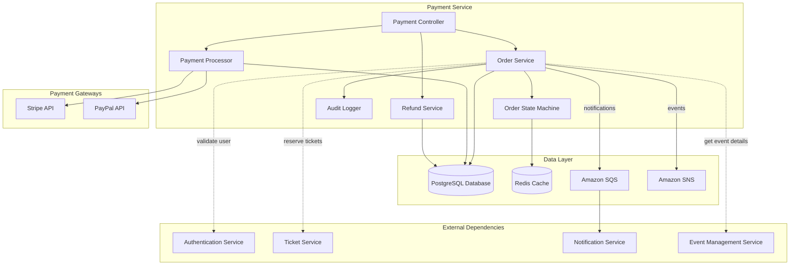
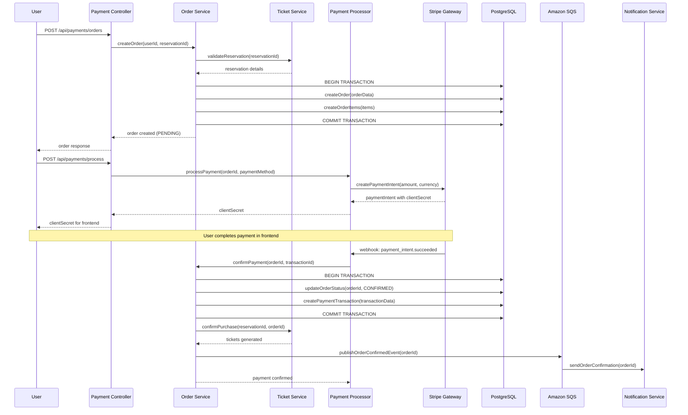
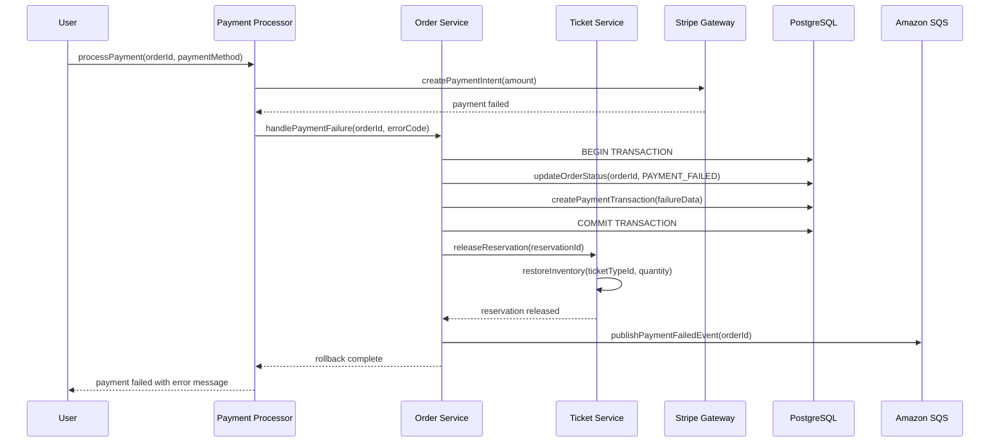
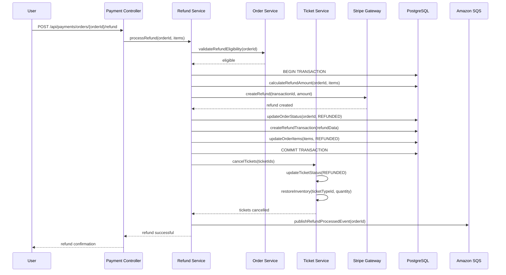
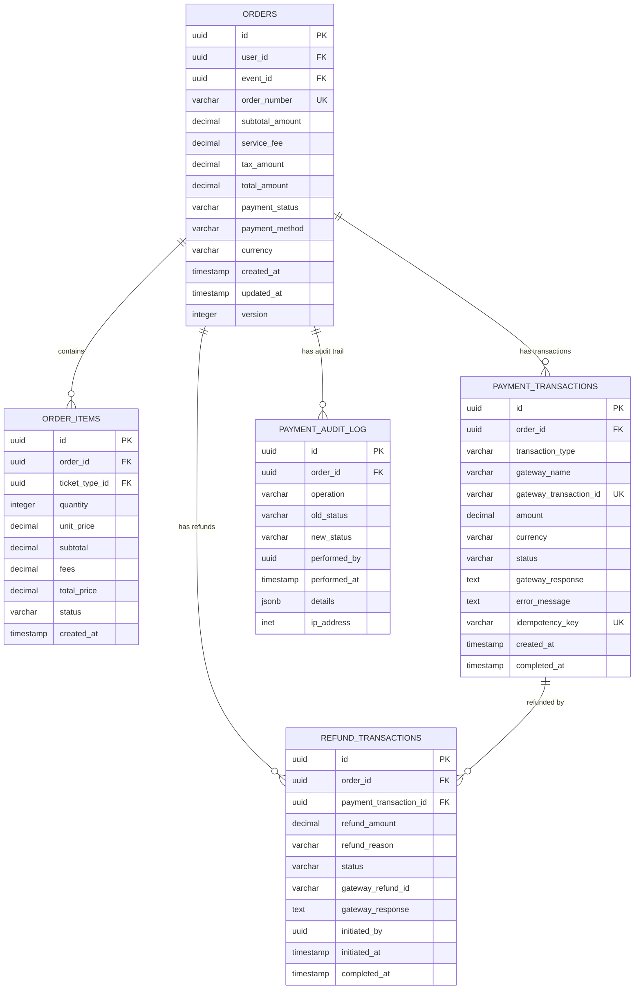
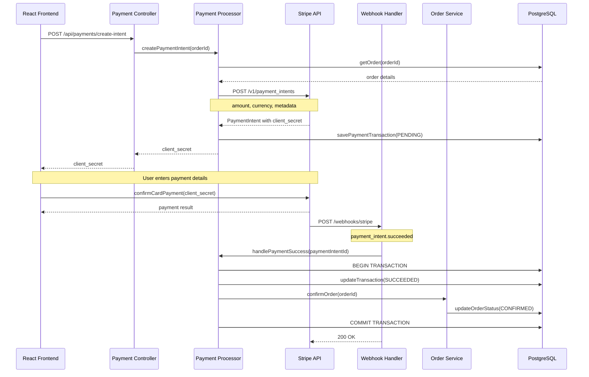
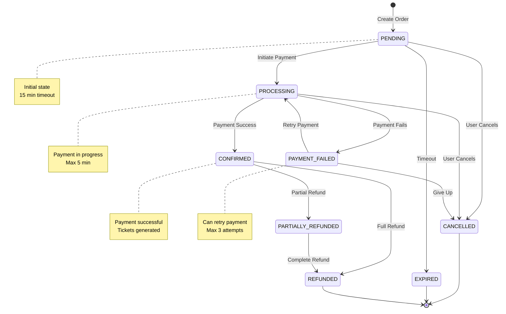

# Payment Service - Detailed Design Document

## Overview

The Payment Service is a critical microservice in the Event Ticket Booking System responsible for managing order processing, payment gateway integration, and transaction integrity. This service ensures PCI DSS compliance, handles complex payment workflows, and maintains transactional consistency across the distributed system.

### Key Responsibilities

- **Order Management**: Creation, tracking, and lifecycle management of ticket orders
- **Payment Processing**: Secure integration with payment gateways (Stripe, PayPal)
- **Transaction Integrity**: ACID compliance and distributed transaction coordination
- **Refund Processing**: Automated and manual refund handling
- **Financial Reconciliation**: Payment tracking and audit trail maintenance
- **Fraud Prevention**: Basic fraud detection and risk assessment

### Design Principles

- **PCI DSS Compliance**: Never store sensitive payment data; use tokenization
- **Transactional Integrity**: Ensure atomic operations across payment and inventory systems
- **Idempotency**: Support retry mechanisms without duplicate charges
- **Audit Trail**: Complete tracking of all financial transactions
- **Fault Tolerance**: Graceful handling of payment gateway failures
- **Performance**: Sub-10-second payment processing under normal load

## Service Architecture

### Component Overview



### Component Interactions

#### Payment Controller Layer
- **REST API Endpoints**: Handles HTTP requests for order and payment operations
- **Input Validation**: Request parameter validation and sanitization
- **Authentication**: JWT token validation through Auth Service
- **Rate Limiting**: API throttling to prevent abuse
- **Error Handling**: Standardized error responses with PCI-compliant messaging

#### Order Service Layer
- **Order Creation**: Orchestrates order creation workflow
- **Order Lifecycle Management**: Tracks order status transitions
- **Price Calculation**: Computes totals including fees and taxes
- **Order History**: Retrieves user order history
- **Cancellation Logic**: Handles order cancellations and partial cancellations

#### Payment Processor
- **Gateway Integration**: Abstracts payment gateway operations
- **Payment Method Handling**: Supports multiple payment methods
- **Tokenization**: Secure payment token management
- **Webhook Processing**: Handles asynchronous payment notifications
- **Retry Logic**: Implements exponential backoff for transient failures

#### Refund Service
- **Refund Processing**: Initiates refunds through payment gateways
- **Partial Refunds**: Supports item-level refund calculations
- **Refund Tracking**: Maintains refund status and history
- **Inventory Restoration**: Coordinates with Ticket Service for inventory updates

#### Order State Machine
- **State Transitions**: Manages valid order status changes
- **Business Rules**: Enforces order lifecycle constraints
- **Event Publishing**: Publishes state change events
- **Rollback Support**: Handles compensation actions for failed transitions

#### Audit Logger
- **Transaction Logging**: Records all payment operations
- **Compliance Tracking**: Maintains PCI DSS audit requirements
- **Forensic Analysis**: Supports investigation of payment issues
- **Data Retention**: Implements retention policies for financial records

## Data Flow Diagrams

### Order Creation and Payment Flow



### Payment Failure and Rollback Flow



### Refund Processing Flow



## Database Schema Documentation

### Core Entity Relationships




### Database Schema with Transaction Integrity

```sql
-- Orders table with optimistic locking
CREATE TABLE orders (
    id UUID PRIMARY KEY DEFAULT gen_random_uuid(),
    user_id UUID NOT NULL,
    event_id UUID NOT NULL,
    order_number VARCHAR(50) UNIQUE NOT NULL,
    subtotal_amount DECIMAL(10,2) NOT NULL CHECK (subtotal_amount >= 0),
    service_fee DECIMAL(10,2) DEFAULT 0 CHECK (service_fee >= 0),
    tax_amount DECIMAL(10,2) DEFAULT 0 CHECK (tax_amount >= 0),
    total_amount DECIMAL(10,2) NOT NULL CHECK (total_amount >= 0),
    payment_status VARCHAR(50) DEFAULT 'PENDING' CHECK (payment_status IN (
        'PENDING', 'PROCESSING', 'CONFIRMED', 'PAYMENT_FAILED', 
        'CANCELLED', 'REFUNDED', 'PARTIALLY_REFUNDED'
    )),
    payment_method VARCHAR(50),
    currency VARCHAR(3) DEFAULT 'USD',
    reservation_id UUID,
    created_at TIMESTAMP DEFAULT CURRENT_TIMESTAMP,
    updated_at TIMESTAMP DEFAULT CURRENT_TIMESTAMP,
    expires_at TIMESTAMP,
    version INTEGER DEFAULT 1 NOT NULL,
    
    CONSTRAINT check_total_calculation CHECK (
        total_amount = subtotal_amount + service_fee + tax_amount
    ),
    CONSTRAINT check_expiry CHECK (expires_at IS NULL OR expires_at > created_at)
);

-- Indexes for order queries
CREATE INDEX idx_orders_user_id ON orders(user_id);
CREATE INDEX idx_orders_event_id ON orders(event_id);
CREATE INDEX idx_orders_status ON orders(payment_status);
CREATE INDEX idx_orders_created_at ON orders(created_at DESC);
CREATE INDEX idx_orders_order_number ON orders(order_number);
CREATE INDEX idx_orders_expiry ON orders(expires_at) WHERE payment_status = 'PENDING';

-- Order items with pricing details
CREATE TABLE order_items (
    id UUID PRIMARY KEY DEFAULT gen_random_uuid(),
    order_id UUID NOT NULL REFERENCES orders(id) ON DELETE CASCADE,
    ticket_type_id UUID NOT NULL,
    quantity INTEGER NOT NULL CHECK (quantity > 0),
    unit_price DECIMAL(10,2) NOT NULL CHECK (unit_price >= 0),
    subtotal DECIMAL(10,2) NOT NULL CHECK (subtotal >= 0),
    fees DECIMAL(10,2) DEFAULT 0 CHECK (fees >= 0),
    total_price DECIMAL(10,2) NOT NULL CHECK (total_price >= 0),
    status VARCHAR(20) DEFAULT 'ACTIVE' CHECK (status IN (
        'ACTIVE', 'CANCELLED', 'REFUNDED'
    )),
    created_at TIMESTAMP DEFAULT CURRENT_TIMESTAMP,
    
    CONSTRAINT check_item_pricing CHECK (
        subtotal = unit_price * quantity AND
        total_price = subtotal + fees
    )
);

-- Indexes for order item queries
CREATE INDEX idx_order_items_order_id ON order_items(order_id);
CREATE INDEX idx_order_items_ticket_type ON order_items(ticket_type_id);
CREATE INDEX idx_order_items_status ON order_items(status);

-- Payment transactions with idempotency
CREATE TABLE payment_transactions (
    id UUID PRIMARY KEY DEFAULT gen_random_uuid(),
    order_id UUID NOT NULL REFERENCES orders(id),
    transaction_type VARCHAR(50) NOT NULL CHECK (transaction_type IN (
        'CHARGE', 'REFUND', 'AUTHORIZATION', 'CAPTURE', 'VOID'
    )),
    gateway_name VARCHAR(50) NOT NULL,
    gateway_transaction_id VARCHAR(255) UNIQUE,
    amount DECIMAL(10,2) NOT NULL CHECK (amount >= 0),
    currency VARCHAR(3) DEFAULT 'USD',
    status VARCHAR(50) NOT NULL CHECK (status IN (
        'PENDING', 'PROCESSING', 'SUCCEEDED', 'FAILED', 'CANCELLED'
    )),
    gateway_response JSONB,
    error_message TEXT,
    error_code VARCHAR(50),
    idempotency_key VARCHAR(255) UNIQUE NOT NULL,
    retry_count INTEGER DEFAULT 0,
    created_at TIMESTAMP DEFAULT CURRENT_TIMESTAMP,
    completed_at TIMESTAMP,
    
    CONSTRAINT check_completion CHECK (
        (status IN ('SUCCEEDED', 'FAILED', 'CANCELLED') AND completed_at IS NOT NULL) OR
        (status IN ('PENDING', 'PROCESSING') AND completed_at IS NULL)
    )
);

-- Indexes for transaction queries
CREATE INDEX idx_transactions_order_id ON payment_transactions(order_id);
CREATE INDEX idx_transactions_gateway_id ON payment_transactions(gateway_transaction_id);
CREATE INDEX idx_transactions_idempotency ON payment_transactions(idempotency_key);
CREATE INDEX idx_transactions_status ON payment_transactions(status);
CREATE INDEX idx_transactions_created_at ON payment_transactions(created_at DESC);

-- Refund transactions
CREATE TABLE refund_transactions (
    id UUID PRIMARY KEY DEFAULT gen_random_uuid(),
    order_id UUID NOT NULL REFERENCES orders(id),
    payment_transaction_id UUID NOT NULL REFERENCES payment_transactions(id),
    refund_amount DECIMAL(10,2) NOT NULL CHECK (refund_amount > 0),
    refund_reason VARCHAR(255),
    status VARCHAR(50) DEFAULT 'PENDING' CHECK (status IN (
        'PENDING', 'PROCESSING', 'SUCCEEDED', 'FAILED'
    )),
    gateway_refund_id VARCHAR(255),
    gateway_response JSONB,
    error_message TEXT,
    initiated_by UUID NOT NULL,
    initiated_at TIMESTAMP DEFAULT CURRENT_TIMESTAMP,
    completed_at TIMESTAMP,
    
    CONSTRAINT check_refund_completion CHECK (
        (status IN ('SUCCEEDED', 'FAILED') AND completed_at IS NOT NULL) OR
        (status IN ('PENDING', 'PROCESSING') AND completed_at IS NULL)
    )
);

-- Indexes for refund queries
CREATE INDEX idx_refunds_order_id ON refund_transactions(order_id);
CREATE INDEX idx_refunds_payment_transaction ON refund_transactions(payment_transaction_id);
CREATE INDEX idx_refunds_status ON refund_transactions(status);
CREATE INDEX idx_refunds_initiated_at ON refund_transactions(initiated_at DESC);

-- Payment audit log for compliance
CREATE TABLE payment_audit_log (
    id UUID PRIMARY KEY DEFAULT gen_random_uuid(),
    order_id UUID REFERENCES orders(id),
    transaction_id UUID REFERENCES payment_transactions(id),
    operation VARCHAR(50) NOT NULL,
    old_status VARCHAR(50),
    new_status VARCHAR(50),
    performed_by UUID NOT NULL,
    performed_at TIMESTAMP DEFAULT CURRENT_TIMESTAMP,
    details JSONB,
    ip_address INET,
    user_agent TEXT,
    request_id VARCHAR(255)
);

-- Index for audit queries
CREATE INDEX idx_audit_order_id ON payment_audit_log(order_id);
CREATE INDEX idx_audit_transaction_id ON payment_audit_log(transaction_id);
CREATE INDEX idx_audit_performed_at ON payment_audit_log(performed_at DESC);
CREATE INDEX idx_audit_operation ON payment_audit_log(operation);
CREATE INDEX idx_audit_performed_by ON payment_audit_log(performed_by);
```

### Transaction Integrity Patterns

#### Database Triggers for Audit Trail

```sql
-- Trigger function for order audit logging
CREATE OR REPLACE FUNCTION audit_order_changes()
RETURNS TRIGGER AS $$
BEGIN
    IF TG_OP = 'UPDATE' THEN
        INSERT INTO payment_audit_log (
            order_id, operation, old_status, new_status, 
            performed_by, details
        ) VALUES (
            NEW.id, 
            'ORDER_UPDATE', 
            OLD.payment_status, 
            NEW.payment_status,
            COALESCE(current_setting('app.current_user_id', true)::UUID, 
                     '00000000-0000-0000-0000-000000000000'),
            jsonb_build_object(
                'old_total', OLD.total_amount,
                'new_total', NEW.total_amount,
                'old_version', OLD.version,
                'new_version', NEW.version
            )
        );
        RETURN NEW;
    ELSIF TG_OP = 'INSERT' THEN
        INSERT INTO payment_audit_log (
            order_id, operation, new_status, 
            performed_by, details
        ) VALUES (
            NEW.id, 
            'ORDER_CREATE', 
            NEW.payment_status,
            COALESCE(current_setting('app.current_user_id', true)::UUID, 
                     '00000000-0000-0000-0000-000000000000'),
            jsonb_build_object(
                'total_amount', NEW.total_amount,
                'order_number', NEW.order_number
            )
        );
        RETURN NEW;
    END IF;
    RETURN NULL;
END;
$$ LANGUAGE plpgsql;

-- Apply trigger to orders table
CREATE TRIGGER order_audit_trigger
    AFTER INSERT OR UPDATE ON orders
    FOR EACH ROW EXECUTE FUNCTION audit_order_changes();

-- Trigger function for payment transaction audit
CREATE OR REPLACE FUNCTION audit_payment_transaction_changes()
RETURNS TRIGGER AS $$
BEGIN
    IF TG_OP = 'INSERT' OR TG_OP = 'UPDATE' THEN
        INSERT INTO payment_audit_log (
            order_id, transaction_id, operation, 
            old_status, new_status, performed_by, details
        ) VALUES (
            NEW.order_id,
            NEW.id,
            CASE WHEN TG_OP = 'INSERT' THEN 'TRANSACTION_CREATE' 
                 ELSE 'TRANSACTION_UPDATE' END,
            CASE WHEN TG_OP = 'UPDATE' THEN OLD.status ELSE NULL END,
            NEW.status,
            COALESCE(current_setting('app.current_user_id', true)::UUID, 
                     '00000000-0000-0000-0000-000000000000'),
            jsonb_build_object(
                'transaction_type', NEW.transaction_type,
                'gateway', NEW.gateway_name,
                'amount', NEW.amount,
                'gateway_transaction_id', NEW.gateway_transaction_id
            )
        );
        RETURN NEW;
    END IF;
    RETURN NULL;
END;
$$ LANGUAGE plpgsql;

-- Apply trigger to payment transactions table
CREATE TRIGGER payment_transaction_audit_trigger
    AFTER INSERT OR UPDATE ON payment_transactions
    FOR EACH ROW EXECUTE FUNCTION audit_payment_transaction_changes();
```

#### Constraint Functions for Data Integrity

```sql
-- Function to validate order totals
CREATE OR REPLACE FUNCTION validate_order_totals()
RETURNS TRIGGER AS $$
DECLARE
    calculated_total DECIMAL(10,2);
BEGIN
    -- Calculate expected total
    calculated_total := NEW.subtotal_amount + NEW.service_fee + NEW.tax_amount;
    
    -- Validate total matches calculation
    IF ABS(NEW.total_amount - calculated_total) > 0.01 THEN
        RAISE EXCEPTION 'Order total mismatch. Expected: %, Got: %', 
            calculated_total, NEW.total_amount;
    END IF;
    
    -- Update timestamp
    NEW.updated_at = CURRENT_TIMESTAMP;
    
    RETURN NEW;
END;
$$ LANGUAGE plpgsql;

-- Apply validation trigger
CREATE TRIGGER validate_order_totals_trigger
    BEFORE INSERT OR UPDATE ON orders
    FOR EACH ROW EXECUTE FUNCTION validate_order_totals();

-- Function to prevent refund amount exceeding payment
CREATE OR REPLACE FUNCTION validate_refund_amount()
RETURNS TRIGGER AS $$
DECLARE
    payment_amount DECIMAL(10,2);
    total_refunded DECIMAL(10,2);
BEGIN
    -- Get original payment amount
    SELECT amount INTO payment_amount
    FROM payment_transactions
    WHERE id = NEW.payment_transaction_id;
    
    -- Calculate total refunded amount including this refund
    SELECT COALESCE(SUM(refund_amount), 0) INTO total_refunded
    FROM refund_transactions
    WHERE payment_transaction_id = NEW.payment_transaction_id
      AND status = 'SUCCEEDED'
      AND id != NEW.id;
    
    -- Validate refund doesn't exceed payment
    IF (total_refunded + NEW.refund_amount) > payment_amount THEN
        RAISE EXCEPTION 'Refund amount exceeds payment. Payment: %, Already refunded: %, Attempting: %',
            payment_amount, total_refunded, NEW.refund_amount;
    END IF;
    
    RETURN NEW;
END;
$$ LANGUAGE plpgsql;

-- Apply refund validation trigger
CREATE TRIGGER validate_refund_amount_trigger
    BEFORE INSERT OR UPDATE ON refund_transactions
    FOR EACH ROW EXECUTE FUNCTION validate_refund_amount();
```


## Stripe Integration Architecture

### Stripe Payment Flow



### Stripe Integration Implementation

```java
@Service
@Slf4j
public class StripePaymentProcessor implements PaymentProcessor {
    
    @Value("${stripe.api.key}")
    private String stripeApiKey;
    
    @Value("${stripe.webhook.secret}")
    private String webhookSecret;
    
    private final PaymentTransactionRepository transactionRepository;
    private final OrderService orderService;
    
    @PostConstruct
    public void init() {
        Stripe.apiKey = stripeApiKey;
    }
    
    @Override
    public PaymentIntentResponse createPaymentIntent(Order order) {
        try {
            // Generate idempotency key
            String idempotencyKey = generateIdempotencyKey(order.getId());
            
            // Create payment intent parameters
            PaymentIntentCreateParams params = PaymentIntentCreateParams.builder()
                .setAmount(convertToStripeAmount(order.getTotalAmount()))
                .setCurrency(order.getCurrency().toLowerCase())
                .putMetadata("order_id", order.getId().toString())
                .putMetadata("user_id", order.getUserId().toString())
                .putMetadata("event_id", order.getEventId().toString())
                .setDescription("Ticket purchase for order " + order.getOrderNumber())
                .setAutomaticPaymentMethods(
                    PaymentIntentCreateParams.AutomaticPaymentMethods.builder()
                        .setEnabled(true)
                        .build()
                )
                .build();
            
            // Create payment intent with idempotency
            RequestOptions requestOptions = RequestOptions.builder()
                .setIdempotencyKey(idempotencyKey)
                .build();
            
            PaymentIntent paymentIntent = PaymentIntent.create(params, requestOptions);
            
            // Save transaction record
            PaymentTransaction transaction = PaymentTransaction.builder()
                .orderId(order.getId())
                .transactionType(TransactionType.CHARGE)
                .gatewayName("STRIPE")
                .gatewayTransactionId(paymentIntent.getId())
                .amount(order.getTotalAmount())
                .currency(order.getCurrency())
                .status(TransactionStatus.PENDING)
                .idempotencyKey(idempotencyKey)
                .build();
            
            transactionRepository.save(transaction);
            
            log.info("Created Stripe payment intent {} for order {}", 
                     paymentIntent.getId(), order.getId());
            
            return PaymentIntentResponse.builder()
                .clientSecret(paymentIntent.getClientSecret())
                .paymentIntentId(paymentIntent.getId())
                .amount(order.getTotalAmount())
                .currency(order.getCurrency())
                .build();
            
        } catch (StripeException e) {
            log.error("Failed to create Stripe payment intent for order {}", order.getId(), e);
            throw new PaymentProcessingException("Failed to create payment intent", e);
        }
    }
    
    @Override
    public void handleWebhook(String payload, String signatureHeader) {
        try {
            // Verify webhook signature
            Event event = Webhook.constructEvent(
                payload, signatureHeader, webhookSecret
            );
            
            log.info("Received Stripe webhook event: {}", event.getType());
            
            // Handle different event types
            switch (event.getType()) {
                case "payment_intent.succeeded":
                    handlePaymentIntentSucceeded(event);
                    break;
                case "payment_intent.payment_failed":
                    handlePaymentIntentFailed(event);
                    break;
                case "charge.refunded":
                    handleChargeRefunded(event);
                    break;
                default:
                    log.debug("Unhandled webhook event type: {}", event.getType());
            }
            
        } catch (SignatureVerificationException e) {
            log.error("Invalid webhook signature", e);
            throw new WebhookVerificationException("Invalid signature", e);
        }
    }
    
    private void handlePaymentIntentSucceeded(Event event) {
        PaymentIntent paymentIntent = (PaymentIntent) event.getDataObjectDeserializer()
            .getObject()
            .orElseThrow(() -> new IllegalStateException("Missing payment intent"));
        
        String orderId = paymentIntent.getMetadata().get("order_id");
        
        try {
            // Update transaction status
            PaymentTransaction transaction = transactionRepository
                .findByGatewayTransactionId(paymentIntent.getId())
                .orElseThrow(() -> new TransactionNotFoundException(paymentIntent.getId()));
            
            transaction.setStatus(TransactionStatus.SUCCEEDED);
            transaction.setCompletedAt(Instant.now());
            transaction.setGatewayResponse(paymentIntent.toJson());
            transactionRepository.save(transaction);
            
            // Confirm order
            orderService.confirmPayment(UUID.fromString(orderId), paymentIntent.getId());
            
            log.info("Payment succeeded for order {}, transaction {}", 
                     orderId, paymentIntent.getId());
            
        } catch (Exception e) {
            log.error("Failed to process payment success for order {}", orderId, e);
            // Don't throw - webhook should return 200 to prevent retries
        }
    }
    
    private void handlePaymentIntentFailed(Event event) {
        PaymentIntent paymentIntent = (PaymentIntent) event.getDataObjectDeserializer()
            .getObject()
            .orElseThrow(() -> new IllegalStateException("Missing payment intent"));
        
        String orderId = paymentIntent.getMetadata().get("order_id");
        String errorMessage = paymentIntent.getLastPaymentError() != null 
            ? paymentIntent.getLastPaymentError().getMessage() 
            : "Payment failed";
        
        try {
            // Update transaction status
            PaymentTransaction transaction = transactionRepository
                .findByGatewayTransactionId(paymentIntent.getId())
                .orElseThrow(() -> new TransactionNotFoundException(paymentIntent.getId()));
            
            transaction.setStatus(TransactionStatus.FAILED);
            transaction.setCompletedAt(Instant.now());
            transaction.setErrorMessage(errorMessage);
            transaction.setGatewayResponse(paymentIntent.toJson());
            transactionRepository.save(transaction);
            
            // Handle payment failure
            orderService.handlePaymentFailure(UUID.fromString(orderId), errorMessage);
            
            log.warn("Payment failed for order {}: {}", orderId, errorMessage);
            
        } catch (Exception e) {
            log.error("Failed to process payment failure for order {}", orderId, e);
        }
    }
    
    @Override
    @Transactional
    public RefundResult processRefund(Order order, BigDecimal refundAmount, String reason) {
        try {
            // Find original payment transaction
            PaymentTransaction paymentTransaction = transactionRepository
                .findByOrderIdAndTransactionTypeAndStatus(
                    order.getId(), 
                    TransactionType.CHARGE, 
                    TransactionStatus.SUCCEEDED
                )
                .orElseThrow(() -> new TransactionNotFoundException(
                    "No successful payment found for order " + order.getId()
                ));
            
            // Create refund with Stripe
            RefundCreateParams params = RefundCreateParams.builder()
                .setPaymentIntent(paymentTransaction.getGatewayTransactionId())
                .setAmount(convertToStripeAmount(refundAmount))
                .setReason(RefundCreateParams.Reason.REQUESTED_BY_CUSTOMER)
                .putMetadata("order_id", order.getId().toString())
                .putMetadata("refund_reason", reason)
                .build();
            
            Refund refund = Refund.create(params);
            
            // Create refund transaction record
            RefundTransaction refundTransaction = RefundTransaction.builder()
                .orderId(order.getId())
                .paymentTransactionId(paymentTransaction.getId())
                .refundAmount(refundAmount)
                .refundReason(reason)
                .status(RefundStatus.SUCCEEDED)
                .gatewayRefundId(refund.getId())
                .gatewayResponse(refund.toJson())
                .initiatedBy(getCurrentUserId())
                .completedAt(Instant.now())
                .build();
            
            refundTransactionRepository.save(refundTransaction);
            
            log.info("Refund processed for order {}, amount: {}", 
                     order.getId(), refundAmount);
            
            return RefundResult.success(refund.getId(), refundAmount);
            
        } catch (StripeException e) {
            log.error("Failed to process refund for order {}", order.getId(), e);
            
            // Save failed refund attempt
            RefundTransaction failedRefund = RefundTransaction.builder()
                .orderId(order.getId())
                .refundAmount(refundAmount)
                .refundReason(reason)
                .status(RefundStatus.FAILED)
                .errorMessage(e.getMessage())
                .initiatedBy(getCurrentUserId())
                .build();
            
            refundTransactionRepository.save(failedRefund);
            
            throw new RefundProcessingException("Failed to process refund", e);
        }
    }
    
    private long convertToStripeAmount(BigDecimal amount) {
        // Stripe expects amounts in cents
        return amount.multiply(BigDecimal.valueOf(100)).longValue();
    }
    
    private String generateIdempotencyKey(UUID orderId) {
        return "order_" + orderId.toString() + "_" + System.currentTimeMillis();
    }
    
    private UUID getCurrentUserId() {
        // Extract from security context
        Authentication auth = SecurityContextHolder.getContext().getAuthentication();
        if (auth != null && auth.getPrincipal() instanceof JwtAuthenticationToken) {
            JwtAuthenticationToken jwt = (JwtAuthenticationToken) auth.getPrincipal();
            return UUID.fromString(jwt.getToken().getClaimAsString("sub"));
        }
        return null;
    }
}
```

### Error Handling Strategies

```java
@Component
public class PaymentErrorHandler {
    
    private final OrderService orderService;
    private final NotificationService notificationService;
    
    public void handlePaymentError(Order order, StripeException exception) {
        String errorCode = exception.getCode();
        String errorMessage = exception.getMessage();
        
        log.error("Payment error for order {}: {} - {}", 
                  order.getId(), errorCode, errorMessage);
        
        // Categorize error and take appropriate action
        if (isCardDeclined(errorCode)) {
            handleCardDeclined(order, errorMessage);
        } else if (isInsufficientFunds(errorCode)) {
            handleInsufficientFunds(order, errorMessage);
        } else if (isExpiredCard(errorCode)) {
            handleExpiredCard(order, errorMessage);
        } else if (isNetworkError(exception)) {
            handleNetworkError(order, exception);
        } else {
            handleGenericError(order, errorMessage);
        }
    }
    
    private void handleCardDeclined(Order order, String message) {
        orderService.updateOrderStatus(order.getId(), OrderStatus.PAYMENT_FAILED);
        notificationService.sendPaymentFailedNotification(
            order.getUserId(), 
            order.getId(), 
            "Your card was declined. Please try a different payment method."
        );
    }
    
    private void handleInsufficientFunds(Order order, String message) {
        orderService.updateOrderStatus(order.getId(), OrderStatus.PAYMENT_FAILED);
        notificationService.sendPaymentFailedNotification(
            order.getUserId(), 
            order.getId(), 
            "Insufficient funds. Please use a different payment method."
        );
    }
    
    private void handleNetworkError(Order order, StripeException exception) {
        // Implement retry logic with exponential backoff
        log.warn("Network error for order {}, will retry", order.getId());
        // Don't update order status yet - allow retry
    }
    
    private boolean isCardDeclined(String errorCode) {
        return "card_declined".equals(errorCode) || 
               "generic_decline".equals(errorCode);
    }
    
    private boolean isInsufficientFunds(String errorCode) {
        return "insufficient_funds".equals(errorCode);
    }
    
    private boolean isExpiredCard(String errorCode) {
        return "expired_card".equals(errorCode);
    }
    
    private boolean isNetworkError(StripeException exception) {
        return exception instanceof ApiConnectionException;
    }
}
```


## Order State Machine and Status Transitions

### Order State Diagram



### State Machine Implementation

```java
@Component
public class OrderStateMachine {
    
    private final OrderRepository orderRepository;
    private final EventPublisher eventPublisher;
    
    // Valid state transitions
    private static final Map<OrderStatus, Set<OrderStatus>> VALID_TRANSITIONS = Map.of(
        OrderStatus.PENDING, Set.of(
            OrderStatus.PROCESSING, 
            OrderStatus.CANCELLED, 
            OrderStatus.EXPIRED
        ),
        OrderStatus.PROCESSING, Set.of(
            OrderStatus.CONFIRMED, 
            OrderStatus.PAYMENT_FAILED, 
            OrderStatus.CANCELLED
        ),
        OrderStatus.PAYMENT_FAILED, Set.of(
            OrderStatus.PROCESSING, 
            OrderStatus.CANCELLED
        ),
        OrderStatus.CONFIRMED, Set.of(
            OrderStatus.PARTIALLY_REFUNDED, 
            OrderStatus.REFUNDED
        ),
        OrderStatus.PARTIALLY_REFUNDED, Set.of(
            OrderStatus.REFUNDED
        )
    );
    
    @Transactional
    public Order transitionTo(UUID orderId, OrderStatus newStatus, String reason) {
        Order order = orderRepository.findById(orderId)
            .orElseThrow(() -> new OrderNotFoundException(orderId));
        
        OrderStatus currentStatus = order.getPaymentStatus();
        
        // Validate transition
        if (!isValidTransition(currentStatus, newStatus)) {
            throw new InvalidStateTransitionException(
                String.format("Cannot transition from %s to %s", currentStatus, newStatus)
            );
        }
        
        // Perform pre-transition actions
        executePreTransitionActions(order, currentStatus, newStatus);
        
        // Update order status
        OrderStatus oldStatus = order.getPaymentStatus();
        order.setPaymentStatus(newStatus);
        order.setUpdatedAt(Instant.now());
        
        // Save with optimistic locking
        try {
            order = orderRepository.save(order);
        } catch (OptimisticLockException e) {
            throw new ConcurrentOrderUpdateException(
                "Order was modified by another transaction", e
            );
        }
        
        // Perform post-transition actions
        executePostTransitionActions(order, oldStatus, newStatus, reason);
        
        // Publish state change event
        eventPublisher.publishOrderStateChanged(order, oldStatus, newStatus, reason);
        
        log.info("Order {} transitioned from {} to {}: {}", 
                 orderId, oldStatus, newStatus, reason);
        
        return order;
    }
    
    private boolean isValidTransition(OrderStatus from, OrderStatus to) {
        Set<OrderStatus> allowedTransitions = VALID_TRANSITIONS.get(from);
        return allowedTransitions != null && allowedTransitions.contains(to);
    }
    
    private void executePreTransitionActions(Order order, OrderStatus from, OrderStatus to) {
        // Execute actions before state change
        if (to == OrderStatus.PROCESSING) {
            validateOrderCanBeProcessed(order);
        } else if (to == OrderStatus.CANCELLED) {
            validateOrderCanBeCancelled(order);
        } else if (to == OrderStatus.REFUNDED || to == OrderStatus.PARTIALLY_REFUNDED) {
            validateOrderCanBeRefunded(order);
        }
    }
    
    private void executePostTransitionActions(Order order, OrderStatus from, 
                                             OrderStatus to, String reason) {
        // Execute actions after state change
        if (to == OrderStatus.CONFIRMED) {
            handleOrderConfirmed(order);
        } else if (to == OrderStatus.PAYMENT_FAILED) {
            handlePaymentFailed(order, reason);
        } else if (to == OrderStatus.CANCELLED) {
            handleOrderCancelled(order, reason);
        } else if (to == OrderStatus.EXPIRED) {
            handleOrderExpired(order);
        } else if (to == OrderStatus.REFUNDED || to == OrderStatus.PARTIALLY_REFUNDED) {
            handleOrderRefunded(order, to);
        }
    }
    
    private void validateOrderCanBeProcessed(Order order) {
        if (order.getExpiresAt() != null && 
            Instant.now().isAfter(order.getExpiresAt())) {
            throw new OrderExpiredException("Order has expired");
        }
    }
    
    private void validateOrderCanBeCancelled(Order order) {
        // Add business rules for cancellation
        if (order.getPaymentStatus() == OrderStatus.REFUNDED) {
            throw new IllegalStateException("Cannot cancel already refunded order");
        }
    }
    
    private void validateOrderCanBeRefunded(Order order) {
        if (order.getPaymentStatus() != OrderStatus.CONFIRMED && 
            order.getPaymentStatus() != OrderStatus.PARTIALLY_REFUNDED) {
            throw new IllegalStateException("Only confirmed orders can be refunded");
        }
    }
    
    private void handleOrderConfirmed(Order order) {
        // Trigger ticket generation
        eventPublisher.publishOrderConfirmed(order);
    }
    
    private void handlePaymentFailed(Order order, String reason) {
        // Release ticket reservation
        eventPublisher.publishPaymentFailed(order, reason);
    }
    
    private void handleOrderCancelled(Order order, String reason) {
        // Release resources
        eventPublisher.publishOrderCancelled(order, reason);
    }
    
    private void handleOrderExpired(Order order) {
        // Cleanup expired order
        eventPublisher.publishOrderExpired(order);
    }
    
    private void handleOrderRefunded(Order order, OrderStatus refundStatus) {
        // Process refund completion
        eventPublisher.publishOrderRefunded(order, refundStatus);
    }
}
```

### Scheduled Order Expiration

```java
@Component
@Slf4j
public class OrderExpirationScheduler {
    
    private final OrderRepository orderRepository;
    private final OrderStateMachine stateMachine;
    
    @Scheduled(fixedDelay = 60000) // Run every minute
    public void expireOrders() {
        Instant now = Instant.now();
        
        List<Order> expiredOrders = orderRepository
            .findByPaymentStatusAndExpiresAtBefore(OrderStatus.PENDING, now);
        
        for (Order order : expiredOrders) {
            try {
                stateMachine.transitionTo(
                    order.getId(), 
                    OrderStatus.EXPIRED, 
                    "Order expired after timeout"
                );
                log.info("Expired order {}", order.getId());
            } catch (Exception e) {
                log.error("Failed to expire order {}", order.getId(), e);
            }
        }
        
        if (!expiredOrders.isEmpty()) {
            log.info("Expired {} orders", expiredOrders.size());
        }
    }
}
```

## REST API Endpoints Design

### API Specification

```yaml
openapi: 3.0.3
info:
  title: Payment Service API
  version: 1.0.0
  description: Microservice for payment processing and order management

paths:
  /api/payments/orders:
    post:
      summary: Create a new order
      security:
        - BearerAuth: []
      requestBody:
        required: true
        content:
          application/json:
            schema:
              $ref: '#/components/schemas/CreateOrderRequest'
      responses:
        201:
          description: Order created successfully
          content:
            application/json:
              schema:
                $ref: '#/components/schemas/OrderResponse'
        400:
          description: Invalid request
        404:
          description: Reservation not found
          
  /api/payments/orders/{orderId}:
    get:
      summary: Get order details
      security:
        - BearerAuth: []
      parameters:
        - name: orderId
          in: path
          required: true
          schema:
            type: string
            format: uuid
      responses:
        200:
          description: Order details
          content:
            application/json:
              schema:
                $ref: '#/components/schemas/OrderResponse'
        404:
          description: Order not found
          
  /api/payments/create-intent:
    post:
      summary: Create payment intent
      security:
        - BearerAuth: []
      requestBody:
        required: true
        content:
          application/json:
            schema:
              $ref: '#/components/schemas/CreatePaymentIntentRequest'
      responses:
        200:
          description: Payment intent created
          content:
            application/json:
              schema:
                $ref: '#/components/schemas/PaymentIntentResponse'
        400:
          description: Invalid order
          
  /api/payments/confirm:
    post:
      summary: Confirm payment completion
      security:
        - BearerAuth: []
      requestBody:
        required: true
        content:
          application/json:
            schema:
              $ref: '#/components/schemas/ConfirmPaymentRequest'
      responses:
        200:
          description: Payment confirmed
          content:
            application/json:
              schema:
                $ref: '#/components/schemas/OrderResponse'
        400:
          description: Payment confirmation failed
          
  /api/payments/orders/{orderId}/cancel:
    post:
      summary: Cancel an order
      security:
        - BearerAuth: []
      parameters:
        - name: orderId
          in: path
          required: true
          schema:
            type: string
            format: uuid
      requestBody:
        content:
          application/json:
            schema:
              $ref: '#/components/schemas/CancelOrderRequest'
      responses:
        200:
          description: Order cancelled
        400:
          description: Cannot cancel order
          
  /api/payments/orders/{orderId}/refund:
    post:
      summary: Process refund for an order
      security:
        - BearerAuth: []
      parameters:
        - name: orderId
          in: path
          required: true
          schema:
            type: string
            format: uuid
      requestBody:
        required: true
        content:
          application/json:
            schema:
              $ref: '#/components/schemas/RefundRequest'
      responses:
        200:
          description: Refund processed
          content:
            application/json:
              schema:
                $ref: '#/components/schemas/RefundResponse'
        400:
          description: Refund not allowed
          
  /api/payments/orders/user/{userId}:
    get:
      summary: Get user's order history
      security:
        - BearerAuth: []
      parameters:
        - name: userId
          in: path
          required: true
          schema:
            type: string
            format: uuid
        - name: status
          in: query
          schema:
            type: string
        - name: page
          in: query
          schema:
            type: integer
            default: 0
        - name: size
          in: query
          schema:
            type: integer
            default: 20
      responses:
        200:
          description: Order history
          content:
            application/json:
              schema:
                $ref: '#/components/schemas/OrderHistoryResponse'
                
  /api/payments/webhooks/stripe:
    post:
      summary: Stripe webhook endpoint
      requestBody:
        required: true
        content:
          application/json:
            schema:
              type: object
      responses:
        200:
          description: Webhook processed
        400:
          description: Invalid webhook

components:
  schemas:
    CreateOrderRequest:
      type: object
      required:
        - reservationId
        - eventId
      properties:
        reservationId:
          type: string
          format: uuid
        eventId:
          type: string
          format: uuid
          
    OrderResponse:
      type: object
      properties:
        id:
          type: string
          format: uuid
        orderNumber:
          type: string
        userId:
          type: string
          format: uuid
        eventId:
          type: string
          format: uuid
        items:
          type: array
          items:
            $ref: '#/components/schemas/OrderItemResponse'
        subtotalAmount:
          type: number
          format: decimal
        serviceFee:
          type: number
          format: decimal
        taxAmount:
          type: number
          format: decimal
        totalAmount:
          type: number
          format: decimal
        paymentStatus:
          type: string
          enum: [PENDING, PROCESSING, CONFIRMED, PAYMENT_FAILED, CANCELLED, REFUNDED, PARTIALLY_REFUNDED]
        paymentMethod:
          type: string
        currency:
          type: string
        createdAt:
          type: string
          format: date-time
        expiresAt:
          type: string
          format: date-time
          
    OrderItemResponse:
      type: object
      properties:
        id:
          type: string
          format: uuid
        ticketTypeId:
          type: string
          format: uuid
        ticketTypeName:
          type: string
        quantity:
          type: integer
        unitPrice:
          type: number
          format: decimal
        totalPrice:
          type: number
          format: decimal
        status:
          type: string
          
    CreatePaymentIntentRequest:
      type: object
      required:
        - orderId
      properties:
        orderId:
          type: string
          format: uuid
          
    PaymentIntentResponse:
      type: object
      properties:
        clientSecret:
          type: string
        paymentIntentId:
          type: string
        amount:
          type: number
          format: decimal
        currency:
          type: string
          
    ConfirmPaymentRequest:
      type: object
      required:
        - orderId
        - paymentIntentId
      properties:
        orderId:
          type: string
          format: uuid
        paymentIntentId:
          type: string
          
    CancelOrderRequest:
      type: object
      properties:
        reason:
          type: string
          maxLength: 500
          
    RefundRequest:
      type: object
      required:
        - reason
      properties:
        items:
          type: array
          items:
            type: string
            format: uuid
          description: Order item IDs to refund (empty for full refund)
        reason:
          type: string
          maxLength: 500
          
    RefundResponse:
      type: object
      properties:
        refundId:
          type: string
          format: uuid
        refundAmount:
          type: number
          format: decimal
        status:
          type: string
        processedAt:
          type: string
          format: date-time
          
    OrderHistoryResponse:
      type: object
      properties:
        orders:
          type: array
          items:
            $ref: '#/components/schemas/OrderResponse'
        pagination:
          $ref: '#/components/schemas/PaginationInfo'
          
    PaginationInfo:
      type: object
      properties:
        page:
          type: integer
        size:
          type: integer
        totalElements:
          type: integer
        totalPages:
          type: integer

  securitySchemes:
    BearerAuth:
      type: http
      scheme: bearer
      bearerFormat: JWT
```


### Controller Implementation

```java
@RestController
@RequestMapping("/api/payments")
@Validated
@Slf4j
public class PaymentController {
    
    private final OrderService orderService;
    private final PaymentProcessor paymentProcessor;
    private final RefundService refundService;
    
    @PostMapping("/orders")
    @PreAuthorize("hasRole('USER')")
    public ResponseEntity<OrderResponse> createOrder(
            @Valid @RequestBody CreateOrderRequest request,
            Authentication authentication) {
        
        UUID userId = extractUserId(authentication);
        
        OrderResponse order = orderService.createOrder(
            userId, 
            request.getReservationId(), 
            request.getEventId()
        );
        
        return ResponseEntity.status(HttpStatus.CREATED).body(order);
    }
    
    @GetMapping("/orders/{orderId}")
    @PreAuthorize("hasRole('USER')")
    public ResponseEntity<OrderResponse> getOrder(
            @PathVariable UUID orderId,
            Authentication authentication) {
        
        UUID userId = extractUserId(authentication);
        OrderResponse order = orderService.getOrderForUser(orderId, userId);
        
        return ResponseEntity.ok(order);
    }
    
    @PostMapping("/create-intent")
    @PreAuthorize("hasRole('USER')")
    public ResponseEntity<PaymentIntentResponse> createPaymentIntent(
            @Valid @RequestBody CreatePaymentIntentRequest request,
            Authentication authentication) {
        
        UUID userId = extractUserId(authentication);
        
        PaymentIntentResponse intent = paymentProcessor.createPaymentIntent(
            request.getOrderId(), 
            userId
        );
        
        return ResponseEntity.ok(intent);
    }
    
    @PostMapping("/confirm")
    @PreAuthorize("hasRole('USER')")
    @Transactional
    public ResponseEntity<OrderResponse> confirmPayment(
            @Valid @RequestBody ConfirmPaymentRequest request,
            Authentication authentication) {
        
        UUID userId = extractUserId(authentication);
        
        OrderResponse order = orderService.confirmPayment(
            request.getOrderId(), 
            request.getPaymentIntentId(),
            userId
        );
        
        return ResponseEntity.ok(order);
    }
    
    @PostMapping("/orders/{orderId}/cancel")
    @PreAuthorize("hasRole('USER')")
    @Transactional
    public ResponseEntity<Void> cancelOrder(
            @PathVariable UUID orderId,
            @RequestBody(required = false) CancelOrderRequest request,
            Authentication authentication) {
        
        UUID userId = extractUserId(authentication);
        String reason = request != null ? request.getReason() : "User requested cancellation";
        
        orderService.cancelOrder(orderId, userId, reason);
        
        return ResponseEntity.ok().build();
    }
    
    @PostMapping("/orders/{orderId}/refund")
    @PreAuthorize("hasRole('USER') or hasRole('ADMIN')")
    @Transactional
    public ResponseEntity<RefundResponse> processRefund(
            @PathVariable UUID orderId,
            @Valid @RequestBody RefundRequest request,
            Authentication authentication) {
        
        UUID userId = extractUserId(authentication);
        
        RefundResponse refund = refundService.processRefund(
            orderId, 
            request.getItems(), 
            request.getReason(),
            userId
        );
        
        return ResponseEntity.ok(refund);
    }
    
    @GetMapping("/orders/user/{userId}")
    @PreAuthorize("hasRole('USER') and #userId == authentication.principal.userId")
    public ResponseEntity<OrderHistoryResponse> getOrderHistory(
            @PathVariable UUID userId,
            @RequestParam(required = false) OrderStatus status,
            @RequestParam(defaultValue = "0") @Min(0) int page,
            @RequestParam(defaultValue = "20") @Min(1) @Max(100) int size) {
        
        Pageable pageable = PageRequest.of(page, size, Sort.by("createdAt").descending());
        OrderHistoryResponse history = orderService.getOrderHistory(userId, status, pageable);
        
        return ResponseEntity.ok(history);
    }
    
    @PostMapping("/webhooks/stripe")
    public ResponseEntity<Void> handleStripeWebhook(
            @RequestBody String payload,
            @RequestHeader("Stripe-Signature") String signatureHeader) {
        
        try {
            paymentProcessor.handleWebhook(payload, signatureHeader);
            return ResponseEntity.ok().build();
        } catch (WebhookVerificationException e) {
            log.error("Invalid webhook signature", e);
            return ResponseEntity.status(HttpStatus.BAD_REQUEST).build();
        } catch (Exception e) {
            log.error("Error processing webhook", e);
            // Return 200 to prevent Stripe retries for non-recoverable errors
            return ResponseEntity.ok().build();
        }
    }
    
    @ExceptionHandler(OrderNotFoundException.class)
    public ResponseEntity<ErrorResponse> handleOrderNotFound(OrderNotFoundException e) {
        ErrorResponse error = ErrorResponse.builder()
            .code("ORDER_NOT_FOUND")
            .message(e.getMessage())
            .timestamp(Instant.now())
            .build();
        
        return ResponseEntity.status(HttpStatus.NOT_FOUND).body(error);
    }
    
    @ExceptionHandler(InvalidStateTransitionException.class)
    public ResponseEntity<ErrorResponse> handleInvalidStateTransition(InvalidStateTransitionException e) {
        ErrorResponse error = ErrorResponse.builder()
            .code("INVALID_STATE_TRANSITION")
            .message(e.getMessage())
            .timestamp(Instant.now())
            .build();
        
        return ResponseEntity.status(HttpStatus.BAD_REQUEST).body(error);
    }
    
    @ExceptionHandler(PaymentProcessingException.class)
    public ResponseEntity<ErrorResponse> handlePaymentProcessing(PaymentProcessingException e) {
        ErrorResponse error = ErrorResponse.builder()
            .code("PAYMENT_PROCESSING_ERROR")
            .message("Unable to process payment. Please try again.")
            .timestamp(Instant.now())
            .build();
        
        return ResponseEntity.status(HttpStatus.BAD_REQUEST).body(error);
    }
    
    private UUID extractUserId(Authentication authentication) {
        JwtAuthenticationToken jwtToken = (JwtAuthenticationToken) authentication;
        return UUID.fromString(jwtToken.getToken().getClaimAsString("sub"));
    }
}
```

## Service Integration Patterns

### Integration with Ticket Service

```java
@Service
@Slf4j
public class TicketServiceClient {
    
    private final RestTemplate restTemplate;
    private final CircuitBreakerFactory circuitBreakerFactory;
    
    @Value("${services.ticket.url}")
    private String ticketServiceUrl;
    
    public ReservationDetails validateReservation(UUID reservationId, String jwtToken) {
        CircuitBreaker circuitBreaker = circuitBreakerFactory.create("ticketService");
        
        return circuitBreaker.run(
            () -> {
                HttpHeaders headers = new HttpHeaders();
                headers.setBearerAuth(jwtToken);
                HttpEntity<Void> entity = new HttpEntity<>(headers);
                
                String url = ticketServiceUrl + "/internal/reservations/" + reservationId;
                ResponseEntity<ReservationDetails> response = restTemplate.exchange(
                    url, 
                    HttpMethod.GET, 
                    entity, 
                    ReservationDetails.class
                );
                
                return response.getBody();
            },
            throwable -> {
                log.error("Failed to validate reservation {}", reservationId, throwable);
                throw new TicketServiceUnavailableException(
                    "Unable to validate reservation", throwable
                );
            }
        );
    }
    
    public void confirmPurchase(UUID reservationId, UUID orderId, String jwtToken) {
        CircuitBreaker circuitBreaker = circuitBreakerFactory.create("ticketService");
        
        circuitBreaker.run(
            () -> {
                HttpHeaders headers = new HttpHeaders();
                headers.setBearerAuth(jwtToken);
                
                ConfirmPurchaseRequest request = new ConfirmPurchaseRequest(reservationId, orderId);
                HttpEntity<ConfirmPurchaseRequest> entity = new HttpEntity<>(request, headers);
                
                String url = ticketServiceUrl + "/internal/reservations/confirm";
                restTemplate.postForEntity(url, entity, Void.class);
                
                return null;
            },
            throwable -> {
                log.error("Failed to confirm purchase for reservation {}", reservationId, throwable);
                throw new TicketServiceUnavailableException(
                    "Unable to confirm purchase", throwable
                );
            }
        );
    }
    
    public void releaseReservation(UUID reservationId, String jwtToken) {
        try {
            HttpHeaders headers = new HttpHeaders();
            headers.setBearerAuth(jwtToken);
            HttpEntity<Void> entity = new HttpEntity<>(headers);
            
            String url = ticketServiceUrl + "/internal/reservations/" + reservationId + "/release";
            restTemplate.exchange(url, HttpMethod.POST, entity, Void.class);
            
            log.info("Released reservation {}", reservationId);
        } catch (Exception e) {
            log.error("Failed to release reservation {}", reservationId, e);
            // Don't throw - this is a cleanup operation
        }
    }
    
    public void cancelTickets(List<UUID> ticketIds, String jwtToken) {
        try {
            HttpHeaders headers = new HttpHeaders();
            headers.setBearerAuth(jwtToken);
            
            CancelTicketsRequest request = new CancelTicketsRequest(ticketIds);
            HttpEntity<CancelTicketsRequest> entity = new HttpEntity<>(request, headers);
            
            String url = ticketServiceUrl + "/internal/tickets/cancel";
            restTemplate.postForEntity(url, entity, Void.class);
            
            log.info("Cancelled {} tickets", ticketIds.size());
        } catch (Exception e) {
            log.error("Failed to cancel tickets", e);
            throw new TicketServiceUnavailableException("Unable to cancel tickets", e);
        }
    }
}
```

### Event Publishing for Asynchronous Communication

```java
@Service
@Slf4j
public class PaymentEventPublisher {
    
    private final SnsClient snsClient;
    private final SqsClient sqsClient;
    private final ObjectMapper objectMapper;
    
    @Value("${aws.sns.payment-events-topic}")
    private String paymentEventsTopic;
    
    @Value("${aws.sqs.notification-queue}")
    private String notificationQueue;
    
    public void publishOrderConfirmed(Order order) {
        try {
            OrderConfirmedEvent event = OrderConfirmedEvent.builder()
                .orderId(order.getId())
                .orderNumber(order.getOrderNumber())
                .userId(order.getUserId())
                .eventId(order.getEventId())
                .totalAmount(order.getTotalAmount())
                .currency(order.getCurrency())
                .confirmedAt(Instant.now())
                .build();
            
            String message = objectMapper.writeValueAsString(event);
            
            // Publish to SNS for multiple subscribers
            PublishRequest publishRequest = PublishRequest.builder()
                .topicArn(paymentEventsTopic)
                .message(message)
                .messageAttributes(Map.of(
                    "eventType", MessageAttributeValue.builder()
                        .dataType("String")
                        .stringValue("ORDER_CONFIRMED")
                        .build()
                ))
                .build();
            
            snsClient.publish(publishRequest);
            
            log.info("Published ORDER_CONFIRMED event for order {}", order.getId());
            
        } catch (Exception e) {
            log.error("Failed to publish order confirmed event", e);
            // Don't throw - event publishing is async
        }
    }
    
    public void publishPaymentFailed(Order order, String reason) {
        try {
            PaymentFailedEvent event = PaymentFailedEvent.builder()
                .orderId(order.getId())
                .userId(order.getUserId())
                .reason(reason)
                .failedAt(Instant.now())
                .build();
            
            String message = objectMapper.writeValueAsString(event);
            
            // Send directly to notification queue
            SendMessageRequest sendRequest = SendMessageRequest.builder()
                .queueUrl(notificationQueue)
                .messageBody(message)
                .messageAttributes(Map.of(
                    "eventType", MessageAttributeValue.builder()
                        .dataType("String")
                        .stringValue("PAYMENT_FAILED")
                        .build()
                ))
                .build();
            
            sqsClient.sendMessage(sendRequest);
            
            log.info("Published PAYMENT_FAILED event for order {}", order.getId());
            
        } catch (Exception e) {
            log.error("Failed to publish payment failed event", e);
        }
    }
    
    public void publishOrderRefunded(Order order, OrderStatus refundStatus) {
        try {
            OrderRefundedEvent event = OrderRefundedEvent.builder()
                .orderId(order.getId())
                .userId(order.getUserId())
                .refundStatus(refundStatus.name())
                .refundedAt(Instant.now())
                .build();
            
            String message = objectMapper.writeValueAsString(event);
            
            PublishRequest publishRequest = PublishRequest.builder()
                .topicArn(paymentEventsTopic)
                .message(message)
                .messageAttributes(Map.of(
                    "eventType", MessageAttributeValue.builder()
                        .dataType("String")
                        .stringValue("ORDER_REFUNDED")
                        .build()
                ))
                .build();
            
            snsClient.publish(publishRequest);
            
            log.info("Published ORDER_REFUNDED event for order {}", order.getId());
            
        } catch (Exception e) {
            log.error("Failed to publish order refunded event", e);
        }
    }
}
```

## Security and Compliance

### PCI DSS Compliance Measures

```java
@Configuration
public class PciComplianceConfig {
    
    /**
     * PCI DSS Requirement 3.4: Render PAN unreadable
     * Never store full card numbers - use tokenization
     */
    @Bean
    public PaymentTokenizer paymentTokenizer() {
        return new StripePaymentTokenizer();
    }
    
    /**
     * PCI DSS Requirement 4: Encrypt transmission of cardholder data
     * Enforce HTTPS for all payment endpoints
     */
    @Bean
    public SecurityFilterChain securityFilterChain(HttpSecurity http) throws Exception {
        http
            .requiresChannel(channel -> channel
                .requestMatchers("/api/payments/**")
                .requiresSecure()
            )
            .authorizeHttpRequests(auth -> auth
                .requestMatchers("/api/payments/webhooks/**").permitAll()
                .requestMatchers("/api/payments/**").authenticated()
            );
        
        return http.build();
    }
    
    /**
     * PCI DSS Requirement 10: Track and monitor all access
     * Comprehensive audit logging
     */
    @Bean
    public AuditLogger auditLogger() {
        return new PciCompliantAuditLogger();
    }
}

@Component
public class PciCompliantAuditLogger {
    
    private final PaymentAuditLogRepository auditLogRepository;
    
    public void logPaymentAttempt(UUID orderId, UUID userId, String ipAddress, 
                                  String userAgent, String result) {
        PaymentAuditLog log = PaymentAuditLog.builder()
            .orderId(orderId)
            .operation("PAYMENT_ATTEMPT")
            .performedBy(userId)
            .ipAddress(InetAddress.getByName(ipAddress))
            .userAgent(userAgent)
            .details(Map.of("result", result))
            .performedAt(Instant.now())
            .build();
        
        auditLogRepository.save(log);
    }
    
    public void logRefundRequest(UUID orderId, UUID userId, BigDecimal amount, 
                                String reason) {
        PaymentAuditLog log = PaymentAuditLog.builder()
            .orderId(orderId)
            .operation("REFUND_REQUEST")
            .performedBy(userId)
            .details(Map.of(
                "amount", amount.toString(),
                "reason", reason
            ))
            .performedAt(Instant.now())
            .build();
        
        auditLogRepository.save(log);
    }
}
```

### Data Masking for Sensitive Information

```java
@Component
public class SensitiveDataMasker {
    
    /**
     * Mask payment card numbers for logging
     * Show only last 4 digits
     */
    public String maskCardNumber(String cardNumber) {
        if (cardNumber == null || cardNumber.length() < 4) {
            return "****";
        }
        
        String lastFour = cardNumber.substring(cardNumber.length() - 4);
        return "************" + lastFour;
    }
    
    /**
     * Mask email addresses for non-PII contexts
     */
    public String maskEmail(String email) {
        if (email == null || !email.contains("@")) {
            return "***@***.***";
        }
        
        String[] parts = email.split("@");
        String localPart = parts[0];
        String domain = parts[1];
        
        String maskedLocal = localPart.length() > 2 
            ? localPart.substring(0, 2) + "***" 
            : "***";
        
        return maskedLocal + "@" + domain;
    }
}
```

## Performance Optimizations

### Connection Pool Configuration

```yaml
spring:
  datasource:
    hikari:
      maximum-pool-size: 30
      minimum-idle: 10
      idle-timeout: 300000
      max-lifetime: 1200000
      connection-timeout: 20000
      leak-detection-threshold: 60000
      
  data:
    redis:
      lettuce:
        pool:
          max-active: 20
          max-idle: 10
          min-idle: 5
          max-wait: 2000ms
```

### Caching Strategy

```java
@Service
public class OrderCacheService {
    
    private final RedisTemplate<String, Object> redisTemplate;
    private static final String ORDER_CACHE_KEY = "order:";
    private static final Duration ORDER_CACHE_TTL = Duration.ofMinutes(15);
    
    public void cacheOrder(Order order) {
        String key = ORDER_CACHE_KEY + order.getId();
        redisTemplate.opsForValue().set(key, order, ORDER_CACHE_TTL);
    }
    
    public Optional<Order> getCachedOrder(UUID orderId) {
        String key = ORDER_CACHE_KEY + orderId;
        Order order = (Order) redisTemplate.opsForValue().get(key);
        return Optional.ofNullable(order);
    }
    
    public void evictOrder(UUID orderId) {
        String key = ORDER_CACHE_KEY + orderId;
        redisTemplate.delete(key);
    }
}
```

This comprehensive Payment Service design document covers all aspects required for implementing a secure, scalable, and PCI DSS-compliant payment processing system, including order management, Stripe integration, state machine implementation, error handling strategies, and inter-service communication patterns.
