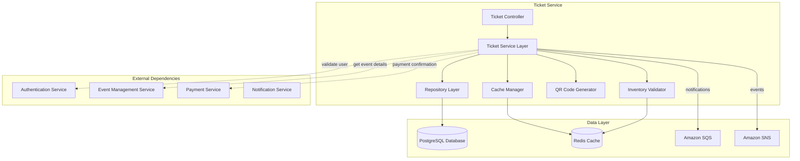
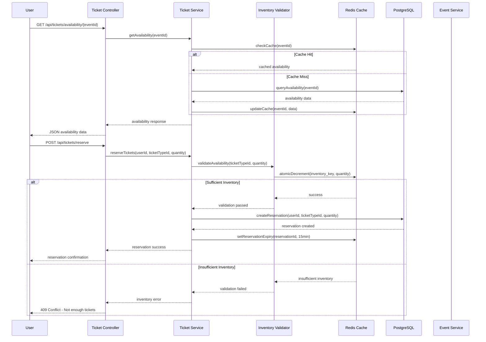
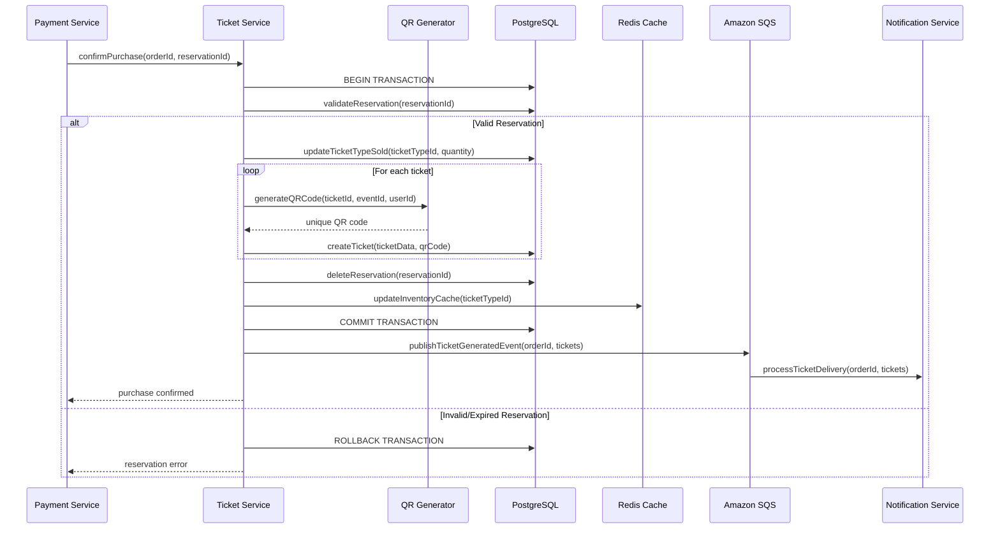
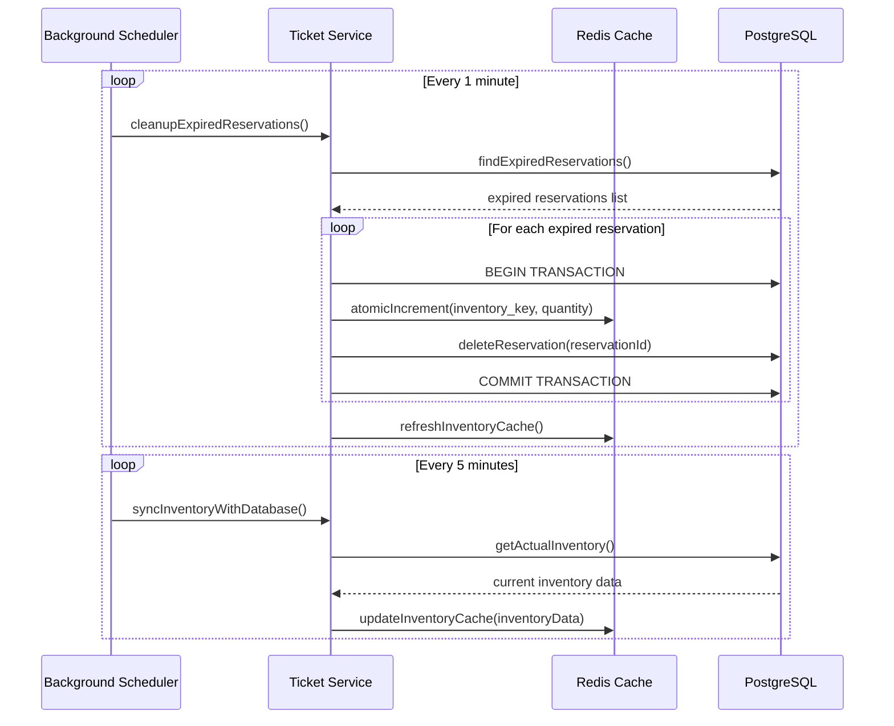
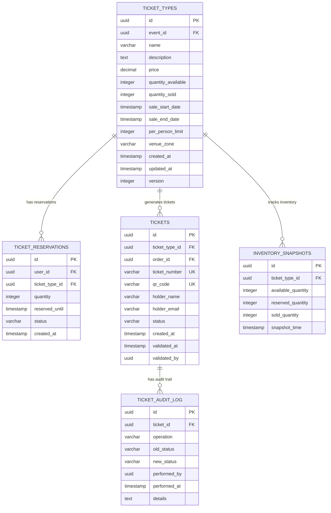
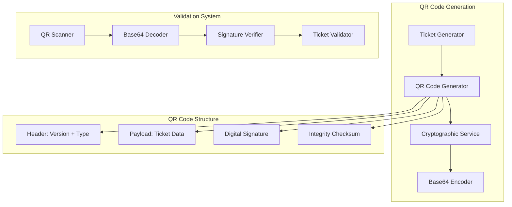
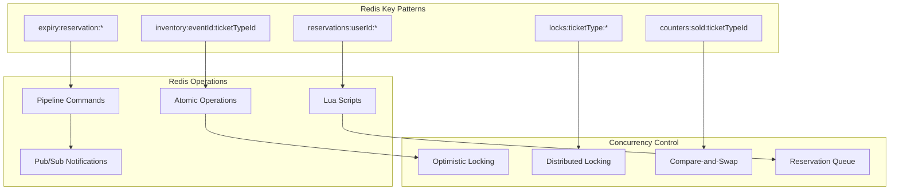

# Ticket Service Design Document

## Overview

The Ticket Service is a critical microservice in the Event Ticket Booking System responsible for managing ticket inventory, reservations, and digital ticket generation. It ensures data consistency during high-concurrency scenarios, prevents overselling, and provides secure QR code-based ticket validation.

### Key Responsibilities

- **Inventory Management**: Real-time tracking of ticket availability across multiple ticket types
- **Reservation System**: Temporary ticket holds during checkout process with automatic expiration
- **Digital Ticket Generation**: Creation of unique tickets with QR codes for validation
- **Concurrency Control**: Prevention of overselling through optimistic locking and Redis-based coordination
- **Performance Optimization**: Sub-second response times for inventory queries and reservations

### Design Principles

- **ACID Compliance**: Transactional integrity for all ticket operations
- **High Concurrency**: Support for 1000+ simultaneous users during peak sales
- **Real-time Consistency**: Immediate inventory updates across all user sessions
- **Fault Tolerance**: Graceful handling of service failures and network partitions
- **Audit Trail**: Complete tracking of all ticket operations for compliance

## Service Architecture

### Component Overview



### Component Interactions

#### Ticket Controller Layer
- **REST API Endpoints**: Handles HTTP requests and responses
- **Input Validation**: Request parameter validation and sanitization
- **Authentication**: JWT token validation through Auth Service
- **Rate Limiting**: API throttling to prevent abuse
- **Error Handling**: Standardized error responses

#### Service Layer
- **Business Logic**: Core ticket operations and workflow orchestration
- **Transaction Management**: Database transaction coordination
- **Cache Management**: Redis operations for performance optimization
- **Event Publishing**: Asynchronous event notifications
- **External Service Integration**: Calls to other microservices

#### Repository Layer
- **Data Access**: PostgreSQL database operations
- **Query Optimization**: Efficient database queries with proper indexing
- **Connection Pooling**: Database connection management
- **Migration Support**: Schema versioning and updates

#### Cache Manager
- **Inventory Caching**: Real-time ticket availability tracking
- **Reservation Management**: Temporary ticket holds in Redis
- **Performance Optimization**: Frequently accessed data caching
- **Cache Invalidation**: Coordinated cache updates

#### QR Code Generator
- **Unique Code Generation**: Cryptographically secure QR codes
- **Format Standardization**: Consistent QR code structure
- **Validation Support**: QR code verification capabilities
- **Audit Logging**: QR code generation tracking

#### Inventory Validator
- **Concurrency Control**: Optimistic locking implementation
- **Availability Checking**: Real-time inventory validation
- **Reservation Coordination**: Multi-user reservation management
- **Overselling Prevention**: Atomic inventory operations

## Data Flow Diagrams

### Ticket Selection and Reservation Flow



### Ticket Purchase and Generation Flow



### Inventory Management and Cleanup Flow



## Database Schema Documentation

### Core Entity Relationships



### Database Schema with Concurrency Control

```sql
-- Ticket Types with optimistic locking
CREATE TABLE ticket_types (
    id UUID PRIMARY KEY DEFAULT gen_random_uuid(),
    event_id UUID NOT NULL,
    name VARCHAR(255) NOT NULL,
    description TEXT,
    price DECIMAL(10,2) NOT NULL CHECK (price >= 0),
    quantity_available INTEGER NOT NULL CHECK (quantity_available >= 0),
    quantity_sold INTEGER DEFAULT 0 CHECK (quantity_sold >= 0),
    sale_start_date TIMESTAMP,
    sale_end_date TIMESTAMP,
    per_person_limit INTEGER DEFAULT 10 CHECK (per_person_limit > 0),
    venue_zone VARCHAR(100),
    created_at TIMESTAMP DEFAULT CURRENT_TIMESTAMP,
    updated_at TIMESTAMP DEFAULT CURRENT_TIMESTAMP,
    version INTEGER DEFAULT 1 NOT NULL, -- Optimistic locking
    
    CONSTRAINT check_sale_dates CHECK (sale_end_date IS NULL OR sale_start_date <= sale_end_date),
    CONSTRAINT check_inventory CHECK (quantity_sold <= quantity_available)
);

-- Indexes for performance
CREATE INDEX idx_ticket_types_event_id ON ticket_types(event_id);
CREATE INDEX idx_ticket_types_sale_dates ON ticket_types(sale_start_date, sale_end_date);
CREATE INDEX idx_ticket_types_status ON ticket_types(event_id) WHERE sale_start_date <= CURRENT_TIMESTAMP AND (sale_end_date IS NULL OR sale_end_date >= CURRENT_TIMESTAMP);

-- Ticket Reservations with automatic cleanup
CREATE TABLE ticket_reservations (
    id UUID PRIMARY KEY DEFAULT gen_random_uuid(),
    user_id UUID NOT NULL,
    ticket_type_id UUID NOT NULL REFERENCES ticket_types(id) ON DELETE CASCADE,
    quantity INTEGER NOT NULL CHECK (quantity > 0),
    reserved_until TIMESTAMP NOT NULL,
    status VARCHAR(20) DEFAULT 'ACTIVE' CHECK (status IN ('ACTIVE', 'EXPIRED', 'CONFIRMED', 'CANCELLED')),
    created_at TIMESTAMP DEFAULT CURRENT_TIMESTAMP,
    
    CONSTRAINT check_reservation_future CHECK (reserved_until > created_at)
);

-- Indexes for reservation management
CREATE INDEX idx_reservations_user_id ON ticket_reservations(user_id);
CREATE INDEX idx_reservations_ticket_type ON ticket_reservations(ticket_type_id);
CREATE INDEX idx_reservations_expiry ON ticket_reservations(reserved_until) WHERE status = 'ACTIVE';
CREATE INDEX idx_reservations_cleanup ON ticket_reservations(status, reserved_until);

-- Generated Tickets with unique constraints
CREATE TABLE tickets (
    id UUID PRIMARY KEY DEFAULT gen_random_uuid(),
    ticket_type_id UUID NOT NULL REFERENCES ticket_types(id),
    order_id UUID NOT NULL,
    ticket_number VARCHAR(50) UNIQUE NOT NULL,
    qr_code VARCHAR(500) UNIQUE NOT NULL,
    holder_name VARCHAR(255) NOT NULL,
    holder_email VARCHAR(255) NOT NULL,
    status VARCHAR(20) DEFAULT 'ACTIVE' CHECK (status IN ('ACTIVE', 'USED', 'CANCELLED', 'REFUNDED')),
    created_at TIMESTAMP DEFAULT CURRENT_TIMESTAMP,
    validated_at TIMESTAMP,
    validated_by UUID,
    
    CONSTRAINT check_validation CHECK (
        (status = 'USED' AND validated_at IS NOT NULL AND validated_by IS NOT NULL) OR
        (status != 'USED' AND validated_at IS NULL AND validated_by IS NULL)
    )
);

-- Indexes for ticket operations
CREATE INDEX idx_tickets_order_id ON tickets(order_id);
CREATE INDEX idx_tickets_ticket_type ON tickets(ticket_type_id);
CREATE INDEX idx_tickets_qr_code ON tickets(qr_code);
CREATE INDEX idx_tickets_holder_email ON tickets(holder_email);
CREATE INDEX idx_tickets_status ON tickets(status);

-- Audit log for compliance
CREATE TABLE ticket_audit_log (
    id UUID PRIMARY KEY DEFAULT gen_random_uuid(),
    ticket_id UUID REFERENCES tickets(id),
    ticket_type_id UUID REFERENCES ticket_types(id),
    operation VARCHAR(50) NOT NULL,
    old_status VARCHAR(20),
    new_status VARCHAR(20),
    performed_by UUID NOT NULL,
    performed_at TIMESTAMP DEFAULT CURRENT_TIMESTAMP,
    details JSONB,
    ip_address INET,
    user_agent TEXT
);

-- Index for audit queries
CREATE INDEX idx_audit_ticket_id ON ticket_audit_log(ticket_id);
CREATE INDEX idx_audit_performed_at ON ticket_audit_log(performed_at);
CREATE INDEX idx_audit_operation ON ticket_audit_log(operation);

-- Inventory snapshots for analytics
CREATE TABLE inventory_snapshots (
    id UUID PRIMARY KEY DEFAULT gen_random_uuid(),
    ticket_type_id UUID NOT NULL REFERENCES ticket_types(id),
    available_quantity INTEGER NOT NULL,
    reserved_quantity INTEGER NOT NULL,
    sold_quantity INTEGER NOT NULL,
    snapshot_time TIMESTAMP DEFAULT CURRENT_TIMESTAMP
);

-- Index for time-series queries
CREATE INDEX idx_snapshots_ticket_type_time ON inventory_snapshots(ticket_type_id, snapshot_time);
```

### Concurrency Control Patterns

#### Optimistic Locking Implementation

```sql
-- Update ticket inventory with version check
UPDATE ticket_types 
SET quantity_sold = quantity_sold + ?, 
    updated_at = CURRENT_TIMESTAMP,
    version = version + 1
WHERE id = ? 
  AND version = ?
  AND quantity_sold + ? <= quantity_available;

-- Check if update was successful (affected rows = 1)
-- If affected rows = 0, handle optimistic lock failure
```

#### Database Triggers for Audit Trail

```sql
-- Trigger function for audit logging
CREATE OR REPLACE FUNCTION audit_ticket_changes()
RETURNS TRIGGER AS $$
BEGIN
    IF TG_OP = 'UPDATE' THEN
        INSERT INTO ticket_audit_log (
            ticket_id, operation, old_status, new_status, 
            performed_by, details
        ) VALUES (
            NEW.id, 'UPDATE', OLD.status, NEW.status,
            COALESCE(current_setting('app.current_user_id', true)::UUID, '00000000-0000-0000-0000-000000000000'),
            jsonb_build_object(
                'old_values', row_to_json(OLD),
                'new_values', row_to_json(NEW)
            )
        );
        RETURN NEW;
    ELSIF TG_OP = 'INSERT' THEN
        INSERT INTO ticket_audit_log (
            ticket_id, operation, new_status, 
            performed_by, details
        ) VALUES (
            NEW.id, 'INSERT', NEW.status,
            COALESCE(current_setting('app.current_user_id', true)::UUID, '00000000-0000-0000-0000-000000000000'),
            row_to_json(NEW)
        );
        RETURN NEW;
    END IF;
    RETURN NULL;
END;
$$ LANGUAGE plpgsql;

-- Apply trigger to tickets table
CREATE TRIGGER ticket_audit_trigger
    AFTER INSERT OR UPDATE ON tickets
    FOR EACH ROW EXECUTE FUNCTION audit_ticket_changes();
```

#### Constraint Functions for Data Integrity

```sql
-- Function to validate ticket type inventory
CREATE OR REPLACE FUNCTION validate_ticket_inventory()
RETURNS TRIGGER AS $$
BEGIN
    -- Ensure sold quantity doesn't exceed available quantity
    IF NEW.quantity_sold > NEW.quantity_available THEN
        RAISE EXCEPTION 'Cannot sell more tickets than available. Available: %, Attempting to sell: %', 
            NEW.quantity_available, NEW.quantity_sold;
    END IF;
    
    -- Update timestamp on changes
    NEW.updated_at = CURRENT_TIMESTAMP;
    
    RETURN NEW;
END;
$$ LANGUAGE plpgsql;

-- Apply validation trigger
CREATE TRIGGER validate_inventory_trigger
    BEFORE UPDATE ON ticket_types
    FOR EACH ROW EXECUTE FUNCTION validate_ticket_inventory();
```

## QR Code Generation and Validation System

### QR Code Architecture



### QR Code Data Structure

```json
{
  "version": "1.0",
  "type": "EVENT_TICKET",
  "ticketId": "550e8400-e29b-41d4-a716-446655440000",
  "eventId": "6ba7b810-9dad-11d1-80b4-00c04fd430c8",
  "ticketTypeId": "6ba7b811-9dad-11d1-80b4-00c04fd430c8",
  "holderName": "John Doe",
  "holderEmail": "john.doe@example.com",
  "eventDate": "2024-12-25T19:00:00Z",
  "venueName": "Madison Square Garden",
  "venueZone": "Section A",
  "issueDate": "2024-01-15T10:30:00Z",
  "signature": "eyJhbGciOiJIUzI1NiIsInR5cCI6IkpXVCJ9...",
  "checksum": "a1b2c3d4e5f6"
}
```

### QR Code Generation Implementation

```java
@Component
public class QRCodeGenerator {
    
    private final CryptographicService cryptoService;
    private final ObjectMapper objectMapper;
    
    public String generateTicketQRCode(Ticket ticket, Event event) {
        try {
            // Create QR code payload
            QRCodePayload payload = QRCodePayload.builder()
                .version("1.0")
                .type("EVENT_TICKET")
                .ticketId(ticket.getId())
                .eventId(event.getId())
                .ticketTypeId(ticket.getTicketTypeId())
                .holderName(ticket.getHolderName())
                .holderEmail(ticket.getHolderEmail())
                .eventDate(event.getEventDate())
                .venueName(event.getVenueName())
                .venueZone(ticket.getVenueZone())
                .issueDate(Instant.now())
                .build();
            
            // Generate digital signature
            String signature = cryptoService.signPayload(payload);
            payload.setSignature(signature);
            
            // Calculate checksum
            String checksum = cryptoService.calculateChecksum(payload);
            payload.setChecksum(checksum);
            
            // Serialize to JSON and encode
            String json = objectMapper.writeValueAsString(payload);
            return Base64.getEncoder().encodeToString(json.getBytes(StandardCharsets.UTF_8));
            
        } catch (Exception e) {
            throw new QRCodeGenerationException("Failed to generate QR code for ticket: " + ticket.getId(), e);
        }
    }
    
    public boolean validateQRCode(String qrCodeData) {
        try {
            // Decode and deserialize
            byte[] decodedBytes = Base64.getDecoder().decode(qrCodeData);
            String json = new String(decodedBytes, StandardCharsets.UTF_8);
            QRCodePayload payload = objectMapper.readValue(json, QRCodePayload.class);
            
            // Verify signature
            if (!cryptoService.verifySignature(payload, payload.getSignature())) {
                return false;
            }
            
            // Verify checksum
            String expectedChecksum = cryptoService.calculateChecksum(payload);
            if (!expectedChecksum.equals(payload.getChecksum())) {
                return false;
            }
            
            // Verify ticket exists and is valid
            return ticketRepository.existsByIdAndStatus(payload.getTicketId(), TicketStatus.ACTIVE);
            
        } catch (Exception e) {
            log.warn("QR code validation failed", e);
            return false;
        }
    }
}
```

### Cryptographic Security Implementation

```java
@Service
public class CryptographicService {
    
    @Value("${ticket.qr.signing.key}")
    private String signingKey;
    
    private final Algorithm algorithm;
    
    @PostConstruct
    public void init() {
        this.algorithm = Algorithm.HMAC256(signingKey);
    }
    
    public String signPayload(QRCodePayload payload) {
        try {
            // Create JWT with payload data
            return JWT.create()
                .withIssuer("ticket-service")
                .withSubject(payload.getTicketId().toString())
                .withClaim("eventId", payload.getEventId().toString())
                .withClaim("holderEmail", payload.getHolderEmail())
                .withIssuedAt(Date.from(payload.getIssueDate()))
                .withExpiresAt(Date.from(payload.getEventDate().plusDays(1)))
                .sign(algorithm);
        } catch (JWTCreationException e) {
            throw new SecurityException("Failed to sign QR code payload", e);
        }
    }
    
    public boolean verifySignature(QRCodePayload payload, String signature) {
        try {
            JWTVerifier verifier = JWT.require(algorithm)
                .withIssuer("ticket-service")
                .withSubject(payload.getTicketId().toString())
                .build();
            
            DecodedJWT jwt = verifier.verify(signature);
            
            // Verify claims match payload
            return payload.getEventId().toString().equals(jwt.getClaim("eventId").asString()) &&
                   payload.getHolderEmail().equals(jwt.getClaim("holderEmail").asString());
                   
        } catch (JWTVerificationException e) {
            return false;
        }
    }
    
    public String calculateChecksum(QRCodePayload payload) {
        try {
            // Create deterministic string representation
            String data = String.format("%s|%s|%s|%s|%s", 
                payload.getTicketId(),
                payload.getEventId(),
                payload.getHolderEmail(),
                payload.getIssueDate().toEpochMilli(),
                payload.getEventDate().toEpochMilli()
            );
            
            // Calculate SHA-256 hash
            MessageDigest digest = MessageDigest.getInstance("SHA-256");
            byte[] hash = digest.digest(data.getBytes(StandardCharsets.UTF_8));
            
            // Return first 12 characters of hex representation
            return DatatypeConverter.printHexBinary(hash).substring(0, 12).toLowerCase();
            
        } catch (NoSuchAlgorithmException e) {
            throw new SecurityException("Failed to calculate checksum", e);
        }
    }
}
```

## Redis-based Inventory Tracking and Reservation System

### Redis Data Structures and Patterns



### Redis Schema Design

```redis
# Inventory tracking
inventory:event:{eventId}:ticket:{ticketTypeId} -> Hash
  - available: 100
  - reserved: 15
  - sold: 85
  - last_updated: 1642234567890

# Active reservations
reservations:user:{userId}:{reservationId} -> Hash
  - ticket_type_id: uuid
  - quantity: 2
  - expires_at: 1642234567890
  - status: ACTIVE

# Distributed locks for atomic operations
locks:ticket_type:{ticketTypeId} -> String (with TTL)
  - value: {nodeId}:{threadId}:{timestamp}
  - ttl: 30 seconds

# Real-time counters
counters:sold:{ticketTypeId} -> Integer
counters:reserved:{ticketTypeId} -> Integer

# Reservation expiry tracking
expiry:reservations -> Sorted Set
  - score: expiration_timestamp
  - member: reservation_id

# Event notifications
notifications:inventory_updates -> Pub/Sub Channel
notifications:reservation_events -> Pub/Sub Channel
```

### Atomic Inventory Operations with Lua Scripts

```lua
-- reserve_tickets.lua
-- Atomically reserve tickets with availability check
local ticket_type_id = KEYS[1]
local user_id = KEYS[2]
local reservation_id = KEYS[3]

local quantity = tonumber(ARGV[1])
local expiry_seconds = tonumber(ARGV[2])
local current_time = tonumber(ARGV[3])

-- Get current inventory
local inventory_key = "inventory:ticket:" .. ticket_type_id
local available = tonumber(redis.call('HGET', inventory_key, 'available') or 0)
local reserved = tonumber(redis.call('HGET', inventory_key, 'reserved') or 0)

-- Check availability
if available < quantity then
    return {0, "INSUFFICIENT_INVENTORY", available}
end

-- Reserve tickets
redis.call('HSET', inventory_key, 'available', available - quantity)
redis.call('HSET', inventory_key, 'reserved', reserved + quantity)
redis.call('HSET', inventory_key, 'last_updated', current_time)

-- Create reservation
local reservation_key = "reservations:user:" .. user_id .. ":" .. reservation_id
redis.call('HMSET', reservation_key,
    'ticket_type_id', ticket_type_id,
    'quantity', quantity,
    'expires_at', current_time + expiry_seconds,
    'status', 'ACTIVE'
)
redis.call('EXPIRE', reservation_key, expiry_seconds)

-- Add to expiry tracking
redis.call('ZADD', 'expiry:reservations', current_time + expiry_seconds, reservation_id)

-- Publish inventory update
redis.call('PUBLISH', 'notifications:inventory_updates', 
    '{"ticket_type_id":"' .. ticket_type_id .. '","available":' .. (available - quantity) .. ',"reserved":' .. (reserved + quantity) .. '}')

return {1, "SUCCESS", available - quantity}
```

```lua
-- confirm_purchase.lua
-- Atomically confirm purchase and update inventory
local ticket_type_id = KEYS[1]
local user_id = KEYS[2]
local reservation_id = KEYS[3]

local quantity = tonumber(ARGV[1])
local current_time = tonumber(ARGV[2])

-- Check reservation exists and is valid
local reservation_key = "reservations:user:" .. user_id .. ":" .. reservation_id
local reservation_exists = redis.call('EXISTS', reservation_key)
if reservation_exists == 0 then
    return {0, "RESERVATION_NOT_FOUND"}
end

local expires_at = tonumber(redis.call('HGET', reservation_key, 'expires_at'))
if current_time > expires_at then
    return {0, "RESERVATION_EXPIRED"}
end

-- Update inventory
local inventory_key = "inventory:ticket:" .. ticket_type_id
local reserved = tonumber(redis.call('HGET', inventory_key, 'reserved') or 0)
local sold = tonumber(redis.call('HGET', inventory_key, 'sold') or 0)

redis.call('HSET', inventory_key, 'reserved', reserved - quantity)
redis.call('HSET', inventory_key, 'sold', sold + quantity)
redis.call('HSET', inventory_key, 'last_updated', current_time)

-- Remove reservation
redis.call('DEL', reservation_key)
redis.call('ZREM', 'expiry:reservations', reservation_id)

-- Update counters
redis.call('INCRBY', 'counters:sold:' .. ticket_type_id, quantity)
redis.call('DECRBY', 'counters:reserved:' .. ticket_type_id, quantity)

-- Publish events
redis.call('PUBLISH', 'notifications:inventory_updates',
    '{"ticket_type_id":"' .. ticket_type_id .. '","reserved":' .. (reserved - quantity) .. ',"sold":' .. (sold + quantity) .. '}')
redis.call('PUBLISH', 'notifications:reservation_events',
    '{"event":"PURCHASE_CONFIRMED","reservation_id":"' .. reservation_id .. '","ticket_type_id":"' .. ticket_type_id .. '"}')

return {1, "SUCCESS", sold + quantity}
```

```lua
-- cleanup_expired_reservations.lua
-- Clean up expired reservations and restore inventory
local current_time = tonumber(ARGV[1])
local batch_size = tonumber(ARGV[2]) or 100

-- Get expired reservations
local expired = redis.call('ZRANGEBYSCORE', 'expiry:reservations', 0, current_time, 'LIMIT', 0, batch_size)
local cleaned_count = 0

for i = 1, #expired do
    local reservation_id = expired[i]
    
    -- Find reservation by scanning user keys (in production, maintain reverse index)
    local keys = redis.call('KEYS', 'reservations:user:*:' .. reservation_id)
    
    for j = 1, #keys do
        local reservation_key = keys[j]
        local ticket_type_id = redis.call('HGET', reservation_key, 'ticket_type_id')
        local quantity = tonumber(redis.call('HGET', reservation_key, 'quantity'))
        
        if ticket_type_id and quantity then
            -- Restore inventory
            local inventory_key = "inventory:ticket:" .. ticket_type_id
            local available = tonumber(redis.call('HGET', inventory_key, 'available') or 0)
            local reserved = tonumber(redis.call('HGET', inventory_key, 'reserved') or 0)
            
            redis.call('HSET', inventory_key, 'available', available + quantity)
            redis.call('HSET', inventory_key, 'reserved', math.max(0, reserved - quantity))
            redis.call('HSET', inventory_key, 'last_updated', current_time)
            
            -- Update counters
            redis.call('DECRBY', 'counters:reserved:' .. ticket_type_id, quantity)
            
            -- Remove reservation
            redis.call('DEL', reservation_key)
            cleaned_count = cleaned_count + 1
            
            -- Publish inventory update
            redis.call('PUBLISH', 'notifications:inventory_updates',
                '{"ticket_type_id":"' .. ticket_type_id .. '","available":' .. (available + quantity) .. ',"reserved":' .. math.max(0, reserved - quantity) .. '}')
        end
    end
    
    -- Remove from expiry tracking
    redis.call('ZREM', 'expiry:reservations', reservation_id)
end

return cleaned_count
```

### Java Implementation of Redis Operations

```java
@Service
public class RedisInventoryService {
    
    private final RedisTemplate<String, Object> redisTemplate;
    private final DefaultRedisScript<List> reserveTicketsScript;
    private final DefaultRedisScript<List> confirmPurchaseScript;
    private final DefaultRedisScript<Long> cleanupExpiredScript;
    
    public ReservationResult reserveTickets(UUID ticketTypeId, UUID userId, int quantity) {
        String reservationId = UUID.randomUUID().toString();
        
        List<String> keys = Arrays.asList(
            ticketTypeId.toString(),
            userId.toString(),
            reservationId
        );
        
        Object[] args = {
            quantity,
            RESERVATION_EXPIRY_SECONDS,
            System.currentTimeMillis()
        };
        
        List<Object> result = redisTemplate.execute(reserveTicketsScript, keys, args);
        
        if (result != null && !result.isEmpty()) {
            int success = (Integer) result.get(0);
            String message = (String) result.get(1);
            
            if (success == 1) {
                int remainingAvailable = (Integer) result.get(2);
                return ReservationResult.success(reservationId, remainingAvailable);
            } else {
                int availableQuantity = result.size() > 2 ? (Integer) result.get(2) : 0;
                return ReservationResult.failure(message, availableQuantity);
            }
        }
        
        throw new InventoryServiceException("Failed to execute reservation script");
    }
    
    public PurchaseResult confirmPurchase(UUID ticketTypeId, UUID userId, String reservationId, int quantity) {
        List<String> keys = Arrays.asList(
            ticketTypeId.toString(),
            userId.toString(),
            reservationId
        );
        
        Object[] args = {
            quantity,
            System.currentTimeMillis()
        };
        
        List<Object> result = redisTemplate.execute(confirmPurchaseScript, keys, args);
        
        if (result != null && !result.isEmpty()) {
            int success = (Integer) result.get(0);
            String message = (String) result.get(1);
            
            if (success == 1) {
                int totalSold = (Integer) result.get(2);
                return PurchaseResult.success(totalSold);
            } else {
                return PurchaseResult.failure(message);
            }
        }
        
        throw new InventoryServiceException("Failed to execute purchase confirmation script");
    }
    
    @Scheduled(fixedDelay = 60000) // Run every minute
    public void cleanupExpiredReservations() {
        Object[] args = {
            System.currentTimeMillis(),
            100 // batch size
        };
        
        Long cleanedCount = redisTemplate.execute(cleanupExpiredScript, Collections.emptyList(), args);
        
        if (cleanedCount != null && cleanedCount > 0) {
            log.info("Cleaned up {} expired reservations", cleanedCount);
        }
    }
    
    public InventoryStatus getInventoryStatus(UUID ticketTypeId) {
        String inventoryKey = "inventory:ticket:" + ticketTypeId;
        
        Map<Object, Object> inventory = redisTemplate.opsForHash().entries(inventoryKey);
        
        if (inventory.isEmpty()) {
            // Cache miss - load from database
            return loadInventoryFromDatabase(ticketTypeId);
        }
        
        return InventoryStatus.builder()
            .available(Integer.parseInt(inventory.get("available").toString()))
            .reserved(Integer.parseInt(inventory.get("reserved").toString()))
            .sold(Integer.parseInt(inventory.get("sold").toString()))
            .lastUpdated(Long.parseLong(inventory.get("last_updated").toString()))
            .build();
    }
    
    private InventoryStatus loadInventoryFromDatabase(UUID ticketTypeId) {
        TicketType ticketType = ticketTypeRepository.findById(ticketTypeId)
            .orElseThrow(() -> new TicketTypeNotFoundException(ticketTypeId));
        
        int reserved = getActiveReservationCount(ticketTypeId);
        int available = ticketType.getQuantityAvailable() - ticketType.getQuantitySold() - reserved;
        
        InventoryStatus status = InventoryStatus.builder()
            .available(available)
            .reserved(reserved)
            .sold(ticketType.getQuantitySold())
            .lastUpdated(System.currentTimeMillis())
            .build();
        
        // Update cache
        updateInventoryCache(ticketTypeId, status);
        
        return status;
    }
    
    private void updateInventoryCache(UUID ticketTypeId, InventoryStatus status) {
        String inventoryKey = "inventory:ticket:" + ticketTypeId;
        
        Map<String, Object> inventoryData = Map.of(
            "available", status.getAvailable(),
            "reserved", status.getReserved(),
            "sold", status.getSold(),
            "last_updated", status.getLastUpdated()
        );
        
        redisTemplate.opsForHash().putAll(inventoryKey, inventoryData);
        redisTemplate.expire(inventoryKey, Duration.ofMinutes(30));
    }
}
```

### Real-time Inventory Updates with Redis Pub/Sub

```java
@Component
public class InventoryUpdateListener {
    
    private final SimpMessagingTemplate messagingTemplate;
    private final ObjectMapper objectMapper;
    
    @EventListener
    public void handleInventoryUpdate(InventoryUpdateEvent event) {
        try {
            // Broadcast to WebSocket subscribers
            String destination = "/topic/inventory/" + event.getTicketTypeId();
            messagingTemplate.convertAndSend(destination, event);
            
            // Update any cached data
            invalidateRelatedCaches(event.getTicketTypeId());
            
        } catch (Exception e) {
            log.error("Failed to process inventory update event", e);
        }
    }
    
    @RedisMessageListener(channels = "notifications:inventory_updates")
    public void onInventoryUpdate(String channel, String message) {
        try {
            InventoryUpdateEvent event = objectMapper.readValue(message, InventoryUpdateEvent.class);
            handleInventoryUpdate(event);
        } catch (Exception e) {
            log.error("Failed to parse inventory update message: {}", message, e);
        }
    }
    
    private void invalidateRelatedCaches(UUID ticketTypeId) {
        // Invalidate event-level caches
        cacheManager.getCache("eventAvailability").evict(ticketTypeId);
        
        // Invalidate search result caches that might include this ticket type
        cacheManager.getCache("searchResults").clear();
    }
}
```

## REST API Endpoints Design

### API Specification

```yaml
openapi: 3.0.3
info:
  title: Ticket Service API
  version: 1.0.0
  description: Microservice for ticket inventory management and digital ticket generation

paths:
  /api/tickets/availability/{eventId}:
    get:
      summary: Get ticket availability for an event
      parameters:
        - name: eventId
          in: path
          required: true
          schema:
            type: string
            format: uuid
      responses:
        200:
          description: Ticket availability information
          content:
            application/json:
              schema:
                $ref: '#/components/schemas/TicketAvailabilityResponse'
        404:
          description: Event not found
          
  /api/tickets/reserve:
    post:
      summary: Reserve tickets for purchase
      security:
        - BearerAuth: []
      requestBody:
        required: true
        content:
          application/json:
            schema:
              $ref: '#/components/schemas/ReserveTicketsRequest'
      responses:
        200:
          description: Tickets reserved successfully
          content:
            application/json:
              schema:
                $ref: '#/components/schemas/ReservationResponse'
        409:
          description: Insufficient inventory
        400:
          description: Invalid request parameters
          
  /api/tickets/purchase:
    post:
      summary: Confirm ticket purchase
      security:
        - BearerAuth: []
      requestBody:
        required: true
        content:
          application/json:
            schema:
              $ref: '#/components/schemas/PurchaseTicketsRequest'
      responses:
        200:
          description: Purchase confirmed
          content:
            application/json:
              schema:
                $ref: '#/components/schemas/PurchaseResponse'
        400:
          description: Invalid reservation or expired
        404:
          description: Reservation not found
          
  /api/tickets/user/{userId}:
    get:
      summary: Get user's tickets
      security:
        - BearerAuth: []
      parameters:
        - name: userId
          in: path
          required: true
          schema:
            type: string
            format: uuid
        - name: status
          in: query
          schema:
            type: string
            enum: [ACTIVE, USED, CANCELLED, REFUNDED]
        - name: page
          in: query
          schema:
            type: integer
            default: 0
        - name: size
          in: query
          schema:
            type: integer
            default: 20
      responses:
        200:
          description: User's tickets
          content:
            application/json:
              schema:
                $ref: '#/components/schemas/UserTicketsResponse'
                
  /api/tickets/{ticketId}:
    get:
      summary: Get ticket details
      security:
        - BearerAuth: []
      parameters:
        - name: ticketId
          in: path
          required: true
          schema:
            type: string
            format: uuid
      responses:
        200:
          description: Ticket details
          content:
            application/json:
              schema:
                $ref: '#/components/schemas/TicketResponse'
        404:
          description: Ticket not found
          
  /api/tickets/{ticketId}/validate:
    post:
      summary: Validate ticket QR code
      security:
        - BearerAuth: []
      parameters:
        - name: ticketId
          in: path
          required: true
          schema:
            type: string
            format: uuid
      requestBody:
        required: true
        content:
          application/json:
            schema:
              $ref: '#/components/schemas/ValidateTicketRequest'
      responses:
        200:
          description: Ticket validation result
          content:
            application/json:
              schema:
                $ref: '#/components/schemas/ValidationResponse'
                
  /api/tickets/{ticketId}/resend:
    post:
      summary: Resend ticket to user
      security:
        - BearerAuth: []
      parameters:
        - name: ticketId
          in: path
          required: true
          schema:
            type: string
            format: uuid
      responses:
        200:
          description: Ticket resent successfully
        404:
          description: Ticket not found

components:
  schemas:
    TicketAvailabilityResponse:
      type: object
      properties:
        eventId:
          type: string
          format: uuid
        ticketTypes:
          type: array
          items:
            $ref: '#/components/schemas/TicketTypeAvailability'
            
    TicketTypeAvailability:
      type: object
      properties:
        id:
          type: string
          format: uuid
        name:
          type: string
        description:
          type: string
        price:
          type: number
          format: decimal
        available:
          type: integer
        venueZone:
          type: string
        perPersonLimit:
          type: integer
        saleStartDate:
          type: string
          format: date-time
        saleEndDate:
          type: string
          format: date-time
          
    ReserveTicketsRequest:
      type: object
      required:
        - ticketTypeId
        - quantity
      properties:
        ticketTypeId:
          type: string
          format: uuid
        quantity:
          type: integer
          minimum: 1
          maximum: 10
          
    ReservationResponse:
      type: object
      properties:
        reservationId:
          type: string
        expiresAt:
          type: string
          format: date-time
        ticketTypeId:
          type: string
          format: uuid
        quantity:
          type: integer
        totalPrice:
          type: number
          format: decimal
        remainingAvailable:
          type: integer
          
    PurchaseTicketsRequest:
      type: object
      required:
        - reservationId
        - orderId
      properties:
        reservationId:
          type: string
        orderId:
          type: string
          format: uuid
        holderDetails:
          type: array
          items:
            $ref: '#/components/schemas/TicketHolderDetails'
            
    TicketHolderDetails:
      type: object
      required:
        - name
        - email
      properties:
        name:
          type: string
          maxLength: 255
        email:
          type: string
          format: email
          
    PurchaseResponse:
      type: object
      properties:
        tickets:
          type: array
          items:
            $ref: '#/components/schemas/TicketResponse'
            
    TicketResponse:
      type: object
      properties:
        id:
          type: string
          format: uuid
        ticketNumber:
          type: string
        qrCode:
          type: string
        holderName:
          type: string
        holderEmail:
          type: string
        status:
          type: string
          enum: [ACTIVE, USED, CANCELLED, REFUNDED]
        eventDetails:
          $ref: '#/components/schemas/EventDetails'
        createdAt:
          type: string
          format: date-time
          
    EventDetails:
      type: object
      properties:
        id:
          type: string
          format: uuid
        name:
          type: string
        eventDate:
          type: string
          format: date-time
        venueName:
          type: string
        venueAddress:
          type: string
        venueZone:
          type: string
          
    UserTicketsResponse:
      type: object
      properties:
        tickets:
          type: array
          items:
            $ref: '#/components/schemas/TicketResponse'
        pagination:
          $ref: '#/components/schemas/PaginationInfo'
          
    PaginationInfo:
      type: object
      properties:
        page:
          type: integer
        size:
          type: integer
        totalElements:
          type: integer
        totalPages:
          type: integer
        
    ValidateTicketRequest:
      type: object
      required:
        - qrCodeData
      properties:
        qrCodeData:
          type: string
        validatorId:
          type: string
          format: uuid
          
    ValidationResponse:
      type: object
      properties:
        valid:
          type: boolean
        ticketId:
          type: string
          format: uuid
        holderName:
          type: string
        eventName:
          type: string
        venueZone:
          type: string
        validatedAt:
          type: string
          format: date-time
        message:
          type: string

  securitySchemes:
    BearerAuth:
      type: http
      scheme: bearer
      bearerFormat: JWT
```

### Controller Implementation

```java
@RestController
@RequestMapping("/api/tickets")
@Validated
@Slf4j
public class TicketController {
    
    private final TicketService ticketService;
    private final InventoryService inventoryService;
    private final QRCodeService qrCodeService;
    
    @GetMapping("/availability/{eventId}")
    public ResponseEntity<TicketAvailabilityResponse> getAvailability(
            @PathVariable @Valid @NotNull UUID eventId) {
        
        TicketAvailabilityResponse availability = inventoryService.getEventAvailability(eventId);
        return ResponseEntity.ok(availability);
    }
    
    @PostMapping("/reserve")
    @PreAuthorize("hasRole('USER')")
    public ResponseEntity<ReservationResponse> reserveTickets(
            @Valid @RequestBody ReserveTicketsRequest request,
            Authentication authentication) {
        
        UUID userId = extractUserId(authentication);
        
        ReservationResponse reservation = ticketService.reserveTickets(
            userId, 
            request.getTicketTypeId(), 
            request.getQuantity()
        );
        
        return ResponseEntity.ok(reservation);
    }
    
    @PostMapping("/purchase")
    @PreAuthorize("hasRole('USER')")
    @Transactional
    public ResponseEntity<PurchaseResponse> purchaseTickets(
            @Valid @RequestBody PurchaseTicketsRequest request,
            Authentication authentication) {
        
        UUID userId = extractUserId(authentication);
        
        PurchaseResponse purchase = ticketService.confirmPurchase(
            userId,
            request.getReservationId(),
            request.getOrderId(),
            request.getHolderDetails()
        );
        
        return ResponseEntity.ok(purchase);
    }
    
    @GetMapping("/user/{userId}")
    @PreAuthorize("hasRole('USER') and #userId == authentication.principal.userId")
    public ResponseEntity<UserTicketsResponse> getUserTickets(
            @PathVariable UUID userId,
            @RequestParam(required = false) TicketStatus status,
            @RequestParam(defaultValue = "0") @Min(0) int page,
            @RequestParam(defaultValue = "20") @Min(1) @Max(100) int size) {
        
        Pageable pageable = PageRequest.of(page, size);
        UserTicketsResponse tickets = ticketService.getUserTickets(userId, status, pageable);
        
        return ResponseEntity.ok(tickets);
    }
    
    @GetMapping("/{ticketId}")
    @PreAuthorize("hasRole('USER')")
    public ResponseEntity<TicketResponse> getTicket(
            @PathVariable UUID ticketId,
            Authentication authentication) {
        
        UUID userId = extractUserId(authentication);
        TicketResponse ticket = ticketService.getTicketForUser(ticketId, userId);
        
        return ResponseEntity.ok(ticket);
    }
    
    @PostMapping("/{ticketId}/validate")
    @PreAuthorize("hasRole('VALIDATOR') or hasRole('ORGANIZER')")
    public ResponseEntity<ValidationResponse> validateTicket(
            @PathVariable UUID ticketId,
            @Valid @RequestBody ValidateTicketRequest request,
            Authentication authentication) {
        
        UUID validatorId = extractUserId(authentication);
        
        ValidationResponse validation = qrCodeService.validateTicket(
            ticketId,
            request.getQrCodeData(),
            validatorId
        );
        
        return ResponseEntity.ok(validation);
    }
    
    @PostMapping("/{ticketId}/resend")
    @PreAuthorize("hasRole('USER')")
    public ResponseEntity<Void> resendTicket(
            @PathVariable UUID ticketId,
            Authentication authentication) {
        
        UUID userId = extractUserId(authentication);
        ticketService.resendTicket(ticketId, userId);
        
        return ResponseEntity.ok().build();
    }
    
    @ExceptionHandler(InsufficientInventoryException.class)
    public ResponseEntity<ErrorResponse> handleInsufficientInventory(InsufficientInventoryException e) {
        ErrorResponse error = ErrorResponse.builder()
            .code("INSUFFICIENT_INVENTORY")
            .message(e.getMessage())
            .timestamp(Instant.now())
            .build();
        
        return ResponseEntity.status(HttpStatus.CONFLICT).body(error);
    }
    
    @ExceptionHandler(ReservationExpiredException.class)
    public ResponseEntity<ErrorResponse> handleReservationExpired(ReservationExpiredException e) {
        ErrorResponse error = ErrorResponse.builder()
            .code("RESERVATION_EXPIRED")
            .message(e.getMessage())
            .timestamp(Instant.now())
            .build();
        
        return ResponseEntity.status(HttpStatus.BAD_REQUEST).body(error);
    }
    
    private UUID extractUserId(Authentication authentication) {
        JwtAuthenticationToken jwtToken = (JwtAuthenticationToken) authentication;
        return UUID.fromString(jwtToken.getToken().getClaimAsString("sub"));
    }
}
```

This comprehensive Ticket Service design document covers all the required aspects mentioned in the task, including service architecture, data flow diagrams, database schema with concurrency control, QR code generation and validation system, and Redis-based inventory tracking. The design ensures high performance, data consistency, and security for the ticket booking system.